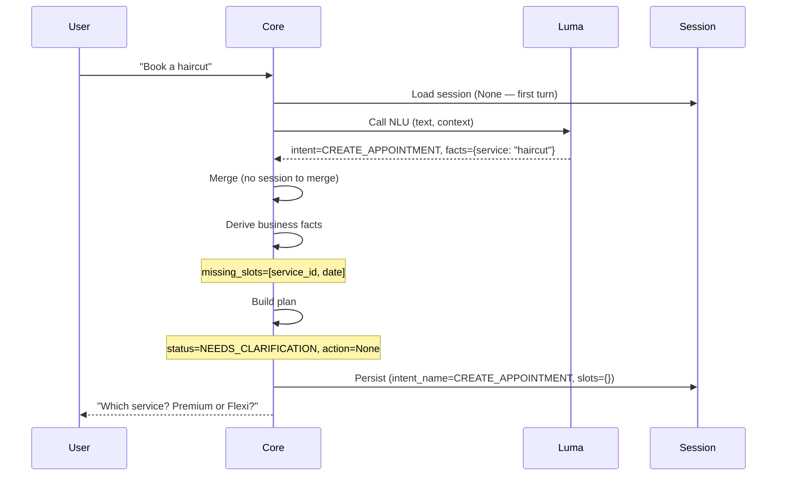
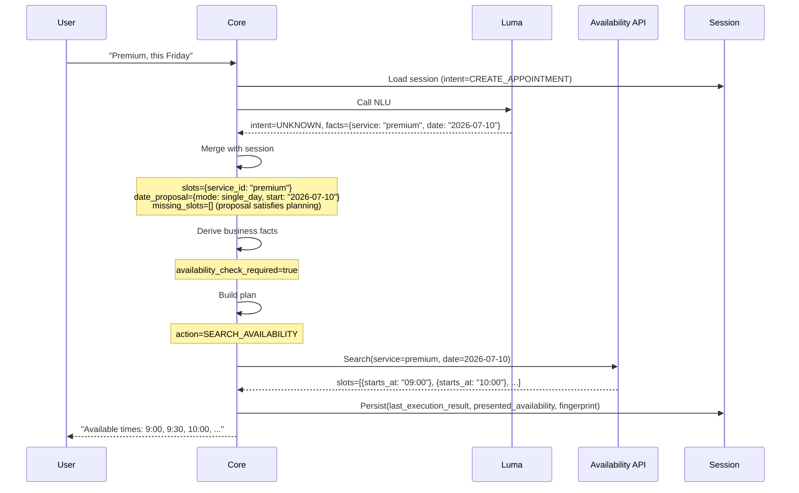
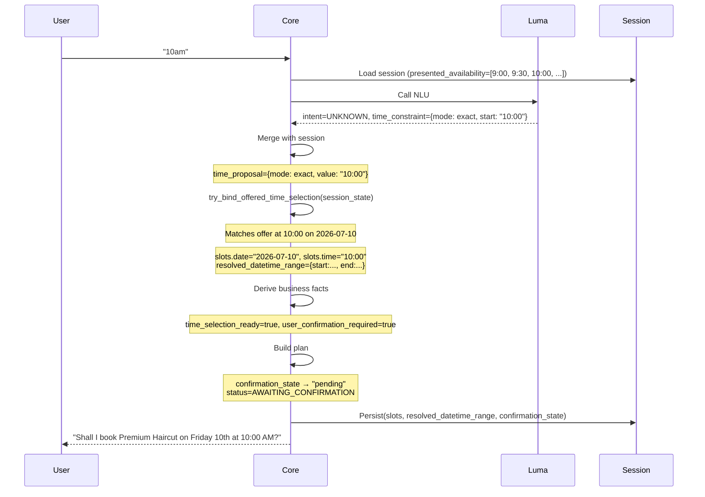
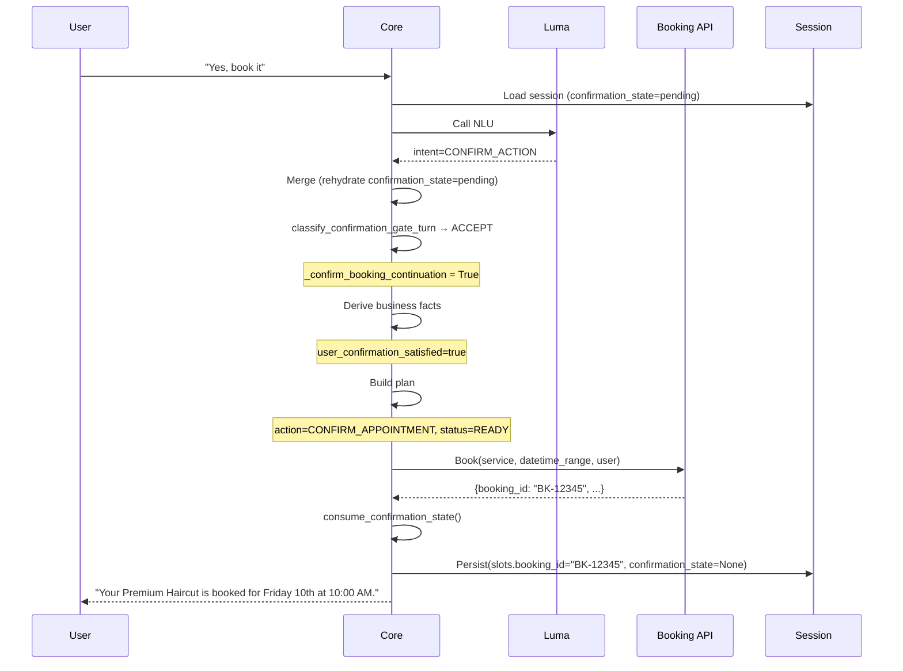
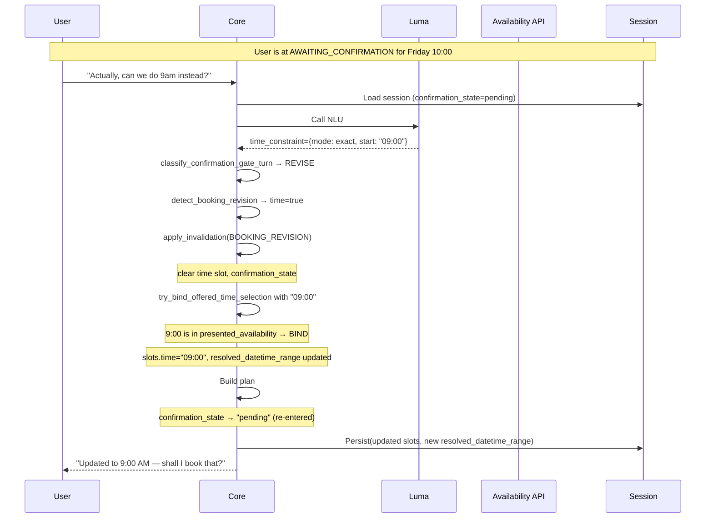
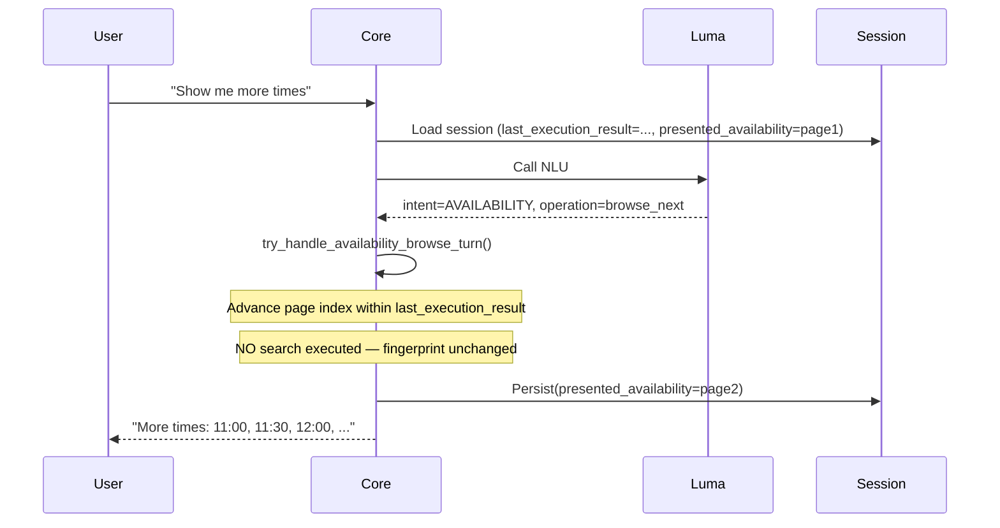

# Core — Architecture Reference

> **Audience:** senior engineer joining the project.
> **Goal:** understand Core's architecture, responsibilities, and design decisions before reading source code.
> **Status:** reflects the codebase as of the `nlu` branch.

---

## Table of Contents

1. [Purpose of Core](#1-purpose-of-core)
2. [High-Level Request Lifecycle](#2-high-level-request-lifecycle)
3. [Major Modules](#3-major-modules)
4. [Session Model](#4-session-model)
5. [Proposal Model](#5-proposal-model)
6. [Business Facts](#6-business-facts)
7. [Planner](#7-planner)
8. [Execution Pipeline](#8-execution-pipeline)
9. [Availability Search](#9-availability-search)
10. [Confirmation Flow](#10-confirmation-flow)
11. [Revision and Invalidation](#11-revision-and-invalidation)
12. [Browse and Pagination](#12-browse-and-pagination)
13. [Tracing System](#13-tracing-system)
14. [Architecture Principles](#14-architecture-principles)
15. [Ownership Matrix](#15-ownership-matrix)
16. [Common Bug Patterns](#16-common-bug-patterns)
17. [Sequence Diagrams](#17-sequence-diagrams)
18. [Glossary](#18-glossary)

---

## 1. Purpose of Core

Core is the **orchestration layer** for the DialogCart booking conversation. It owns the full booking lifecycle after NLU returns a structured understanding of the user utterance.

### What Core does

- Merges NLU output with durable session state accumulated across turns
- Derives business facts (is availability ready? does the user need to confirm?)
- Plans the next action according to policy (what should happen next in this conversation?)
- Dispatches execution (calls availability search or booking APIs)
- Persists durable state between turns
- Builds the reply to return to the frontend

### What Core does NOT do

- **Understand language.** Luma does that. Core receives structured intent + facts and treats them as an authoritative per-turn delta.
- **Own the booking API contract.** Commerce services (availability API, booking API) own their own schemas. Core calls them via typed clients.
- **Drive UI rendering.** Core returns a structured plan. LLM rendering (`core/rendering/`) is best-effort and never fails a turn.
- **Classify capability-level decisions.** Extensions (payment, verification) receive a capability activation signal from Core and return outcomes. They do not own conversation state.

### System context

```
User message
     │
     ▼
 ┌───────┐
 │  Luma │  NLU — intent classification, fact extraction, entity resolution
 └───────┘  Stateless per request. Speaks "what did the user say this turn."
     │
     │  Structured response: intent, facts, slots, proposals, time_constraint
     ▼
 ┌───────────────────────────────────────────────────────────┐
 │  Core                                                     │
 │                                                           │
 │  ┌─────────┐  ┌─────────┐  ┌──────────────────────────┐ │
 │  │  Merge  │  │ Session │  │  Temporal Proposals      │ │
 │  └─────────┘  └─────────┘  └──────────────────────────┘ │
 │  ┌──────────────────┐  ┌──────────────────────────────┐  │
 │  │  Business Facts  │  │  Planner + Plan Builder      │  │
 │  └──────────────────┘  └──────────────────────────────┘  │
 │  ┌────────────┐  ┌─────────────┐  ┌──────────────────┐   │
 │  │ Dispatcher │  │   Clients   │  │  Persistence     │   │
 │  └────────────┘  └─────────────┘  └──────────────────┘   │
 └───────────────────────────────────────────────────────────┘
          │                    │
          ▼                    ▼
  Availability API       Booking API
  (exploratory,          (committing,
   no side effects)       irreversible)
          │
          ▼
   Extensions
   (payment, verification)
```

### Relationship with other systems

| System | Relationship |
|--------|-------------|
| **Luma** | Core calls Luma once per turn. Luma returns a structured delta. Core owns what to do with it. Core never trusts Luma to carry forward session context — that is Core's job. |
| **Availability API** | Called by Core's `availability_client` when `SEARCH_AVAILABILITY` is the planned action. Exploratory — no side effects. Results are cached as domain `AvailabilityCache` (persisted today under the legacy session field `last_execution_result`). |
| **Booking API** | Called by Core's `booking_client` when `CONFIRM_APPOINTMENT` is the planned action. Committing — irreversible. Requires explicit user confirmation before dispatch. |
| **Extensions** | Activated by Core when a capability gate is triggered (e.g., payment). Extensions are called, their outcomes are merged into session facts, and Core plans the next turn. Extensions never own conversation state. |

---

## 2. High-Level Request Lifecycle

Every user message goes through exactly this pipeline:

```
Receive request
      │
      ▼
Load session state from previous turn
      │
      ▼
Call Luma (NLU)
      │  intent, facts, slots, proposals
      ▼
Merge Luma response with session state
      │  resolve intent, merge slots, extract proposals,
      │  bind offered time if applicable, compute missing_slots
      ▼
Derive business facts
      │  availability_ready? time_selection_ready? user_confirmation_satisfied?
      ▼
Build plan
      │  status, stage, action, allowed/blocked actions, awaiting
      ▼
Execute (if action is eligible)
      │  call availability_client or booking_client
      ▼
Persist session state
      │  store durable slots, fingerprint, availability, booking_id
      ▼
Build and return response
```

### Stage-by-stage breakdown

#### Receive request

**Purpose:** Accept a user turn with its context and initialise the request.
**Inputs:** `user_id`, `text`, `domain`, `session_state` (from previous turn), `organization_id`, `planning_only`.
**Outputs:** Initialised clients and parameters.
**Owner:** `core/orchestration/api/main.py` → `orchestrator.py:handle_message()`.

#### Load session state

**Purpose:** Make the accumulated booking context from previous turns available to this turn.
**Inputs:** `user_id` — looked up from the session store.
**Outputs:** `session_state` dict — may be `None` on a first turn.
**Important invariant:** `session_state` is never set to `None` during processing even when a session reset occurs. The old session remains visible for capability fact reconciliation.

#### Call Luma (NLU)

**Purpose:** Extract structured understanding of the current utterance.
**Inputs:** `text`, `domain`, optional conversation context built by Core.
**Outputs:** `luma_response` — intent, facts, time/date proposals, time_constraint, slots, service_candidates.
**Owner:** `luma_client` (HTTP call to production NLU at `src/nlu`; default `LUMA_BASE_URL=http://localhost:9002`).
**Important invariant:** NLU is stateless. Core owns all session context. NLU may receive context to help interpret the current utterance but must not fabricate booking slots absent from the utterance.

#### Merge with session

**Purpose:** Combine the per-turn NLU delta with durable session state to produce the working state for this turn.
**Inputs:** `luma_response`, `session_state`.
**Outputs:** `merged` — a copy of `luma_response` enriched with session slots, merged facts, resolved proposals, and computed `missing_slots`.
**Owner:** `core/session/merge.py:merge_luma_with_session()`.
**See:** [§3 merge](#merge), [§4 Session Model](#4-session-model).

This is the most complex step. Merge does, in order:
1. Resolve intent (session intent is immutable unless reset occurred)
2. Rehydrate persisted `confirmation_state`
3. Extract and merge slots from Luma facts
4. Preserve `time_constraint` from session when current turn doesn't provide one
5. Merge session facts with Luma facts
6. Merge session slots with Luma slots (additive, non-destructive)
7. Extract temporal proposals
8. Promote slots for intent
9. Detect and apply booking revision (if pending confirmation)
10. **Bind offered time** if `time_proposal` matches a presented offer (`try_bind_offered_time_selection`)
11. Apply domain slot filtering
12. Strip unconfirmed temporal slots for `CREATE_APPOINTMENT`
13. Compute `missing_slots` via the planner

#### Derive business facts

**Purpose:** Compute forward-looking boolean facts that the planner needs without letting the planner reimplement the derivation logic.
**Inputs:** `intent_name`, merged `slots`, `session_state`, `luma_response`, `missing_slots`, `confirmation_state`.
**Outputs:** `BusinessFacts` — a frozen dataclass of booleans.
**Owner:** `core/planning/facts/business_fact_registry.py:derive_business_facts()`.
**See:** [§6 Business Facts](#6-business-facts).

#### Build plan

**Purpose:** Decide what should happen next: what to execute (or not), what the conversation status is, what is the planner waiting for.
**Inputs:** `intent_name`, `missing_slots`, `BusinessFacts`, `confirmation_state`, merged response.
**Outputs:** `plan` — `{status, stage, action, allowed_actions, blocked_actions, awaiting, missing_slots}`.
**Owner:** `core/planning/planner/plan_builder.py:build_decision_plan()`.
**See:** [§7 Planner](#7-planner).

#### Execute

**Purpose:** Perform the side-effectful operation selected by the planner.
**Inputs:** `plan.action`, `slots`, clients.
**Outputs:** `execution_result` — availability slots or booking confirmation.
**Owner:** `core/orchestration/orchestrator.py` — dispatches based on `plan.action`.
**Important invariant:** Execution never plans. It calls the client and returns the raw result. The planner never calls clients.

#### Persist session state

**Purpose:** Store the durable facts from this turn so the next turn can merge them.
**Inputs:** `merged`, `plan`, `execution_result`, previous `session_state`.
**Outputs:** Updated `session_state` stored in the session backend.
**Owner:** `core/session/persist.py:build_session_state_from_outcome()`.
**Important invariant:** Only durable state is persisted. Proposals, missing_slots, and ephemeral planning fields are re-derived each turn.

#### Build response

**Purpose:** Construct the reply to the frontend.
**Inputs:** `plan`, `execution_result`, rendered text (from `core/rendering/`).
**Outputs:** HTTP response — plan fields + optional rendered text.
**Important invariant:** Rendering is best-effort. All `_inject_*` calls in `orchestrator.py` catch exceptions. A rendering failure never fails a turn.

---

## 3. Major Modules

### `orchestrator.py`

**Path:** `core/orchestration/orchestrator.py`

**Purpose:** The canonical per-turn entry point for a complete message round-trip (planning + execution).

**Responsibilities:**
- Initialise clients (availability, booking, Luma)
- Call `plan_message()` (planning phase)
- Dispatch execution based on `plan.action`
- Inject rendered text into the response
- Call persistence

**Entry points:**
- `handle_message()` — full round-trip (planning + execution)
- `plan_message()` — planning-only wrapper; used when `planning_only=True`

**Invariant:** `orchestrator.py` selects the execution client based on `plan.action`; it does not select the action. The planner selects the action; it does not call clients.

**Execution dispatch:** After the plan is built, the orchestrator checks `plan.action` against `intent_policy.yaml` steps. If the action is eligible (slots satisfied, mode matches, client available), it calls the client. The stage is then updated: `SEARCH_AVAILABILITY → stage="AVAILABILITY"`, `CONFIRM_APPOINTMENT → stage="CONFIRM"`.

---

### `turn_planner.py`

**Path:** `core/planning/planner/turn_planner.py`

**Purpose:** Orchestrates the planning phase — calls Luma, resolves intent, triggers merge, computes business facts, builds the plan.

**Responsibilities:**
- Build Luma request context from session
- Call `luma_client`
- Resolve effective intent (durable intent from session wins over UNKNOWN from Luma)
- Detect session reset conditions
- Gate merge eligibility (`should_merge_session_context`)
- Call `merge_luma_with_session`
- Compute `missing_slots` and `business_facts`
- Call `build_decision_plan`

**Entry point:** `plan_turn()` — called by `plan_message()`.

**Intent resolution:** Intent recovery runs in multiple passes. If Luma returns `UNKNOWN` and the session has a durable intent in progress, the session intent is preserved. Three separate safety checks enforce this (turn_planner lines ~1597–1668).

**Important invariant:** `plan_turn()` and `plan_message()` never call availability or booking clients. Planning is pure; execution happens only in `handle_message()` after `plan_message()` returns.

---

### `merge.py` (session merge)

**Path:** `core/session/merge.py`

**Purpose:** Combine the per-turn NLU response with accumulated session state to produce the working dict for this turn.

**Responsibilities:**
- Merge session and Luma facts (new Luma facts override session facts)
- Merge session and Luma slots additively (Luma slots override session slots; session slots are never dropped)
- Detect informational turns (no new slots, no actionable facts) and short-circuit
- Extract temporal proposals from Luma response
- Preserve `time_constraint` from session when Luma doesn't provide one
- Trigger booking revision detection when confirmation is pending
- Call `try_bind_offered_time_selection` for `CREATE_APPOINTMENT`
- Apply slot promotion (derived slots from raw slots)
- Apply domain slot filtering
- Strip unconfirmed temporal slots (date/time removed until binding succeeds)
- Compute `missing_slots` via the planner

**Inputs:** `luma_response`, `session_state`, `planning_only`.
**Outputs:** `merged` — enriched working dict for this turn.

**Key invariant — slots are additive:** Session slots are never dropped during merge unless an explicit invalidation rule fires. The merge order is `{**session_slots, **luma_slots}`: current-turn Luma slots override session slots.

**Key invariant — time extraction for CREATE_APPOINTMENT:** For `CREATE_APPOINTMENT`, time is deliberately NOT extracted from `time_constraint` or `time_refs` into `luma_slots`. `time_constraint` is authoritative. `slots.time` is a legacy field. Planning uses `time_proposal`; the planner never relies on `slots.time` for `CREATE_APPOINTMENT`.

**Key invariant — strip unconfirmed temporal slots:** After binding (or failed binding), `strip_unconfirmed_temporal_slots()` removes `date`, `time`, `date_range`, `datetime_range`, `start_date`, `end_date` from the durable slots unless binding succeeded this turn or was already confirmed in a prior turn. This prevents a raw date from the search becoming a durable session slot before the user has selected a time from the presented list.

---

### `temporal_proposal.py`

**Path:** `core/orchestration/temporal_proposal.py`

**Purpose:** Own all date/time proposal logic — extraction, merging, binding, and the confirmed-vs-proposed distinction.

**Responsibilities:**
- `extract_nlu_proposals()` — extract `date_proposal` and `time_proposal` from a Luma response
- `merge_session_proposals()` — merge new proposals with session proposals (new overwrites)
- `try_bind_offered_time_selection()` — bind `time_proposal` against the list of presented offers
- `strip_unconfirmed_temporal_slots()` — remove temporal slots that haven't been confirmed by binding
- `expand_slots_for_planning()` — virtual slot view where proposals satisfy planning requirements
- `has_bound_booking_datetime()` — detect whether a confirmed datetime binding exists
- `build_datetime_range_from_slots()` — construct ISO datetime range from date + time slots
- `slots_for_availability_search()` — slots view for execution (proposals fill in missing confirmed slots)

**See:** [§5 Proposal Model](#5-proposal-model), [§9 Availability Search](#9-availability-search).

---

### `invalidation.py`

**Path:** `core/session/invalidation.py`

**Purpose:** Central registry for explicit slot and state invalidation. Merge is additive by default; state is removed only through registered triggers.

**Responsibilities:**
- Define `InvalidationTrigger` enum — the complete set of reasons state can be removed
- Define declarative `INVALIDATION_RULES` — what each trigger clears
- `apply_invalidation()` — the single entry point for all invalidation

**Triggers:**

| Trigger | What it clears |
|---------|---------------|
| `REJECT_CONFIRMATION` | confirmation_state, `time` slot |
| `REVISE_FALLBACK` | confirmation_state, `time` slot |
| `TIME_REBOUND` | confirmation_state only |
| `UNBOUND_PROPOSAL_WHILE_PENDING` | confirmation_state only |
| `BOOKING_REVISION` | confirmation_state + slots/state derived from which fields revised (service/date/time) |
| `AMBIGUOUS_SERVICE` | `service_id` from merged slots and facts |
| `NEW_BOOKING_REQUEST` | `booking_id`, `availability_fingerprint` |

**Important invariant:** All state removal goes through `apply_invalidation()`. Direct deletion of session keys is a bug; the only authorised exception is inside the custom handlers registered in `_CUSTOM_HANDLERS`.

---

### `confirmation_gate.py`

**Path:** `core/session/confirmation_gate.py`

**Purpose:** Own the confirmation lifecycle — entering, classifying, exiting.

**Responsibilities:**
- `get_confirmation_state()` / `set_confirmation_state()` — canonical top-level read/write, with temporary fallback reads from legacy `booking.confirmation_state`
- `classify_confirmation_gate_turn()` — per-turn classification: ACCEPT, REJECT, REVISE, NONE
- `is_confirmation_gate_open()` — is the user currently at the confirmation prompt?
- `detect_booking_revision()` — which booking fields does this turn change?
- `clear_pending_confirmation()` — authoritative clear with fine-grained field control
- `has_actionable_booking_facts()` — does this turn have facts that must reach binding/planning (prevents informational-turn short-circuit from skipping revisions)

**Classification priority when gate is open:**
1. REVISE — any revision facts present (service, date, or time changed)
2. ACCEPT — raw `CONFIRM_ACTION` intent, no revision facts
3. REJECT — raw `REJECT_ACTION` intent, no revision facts
4. NONE — default

**`confirmation_state` values:**
- `None` — no active confirmation workflow
- `"pending"` — user has been presented a summary and asked to confirm
- `"confirmed"` — transient authorization; consumed immediately after successful commit

**See:** [§10 Confirmation Flow](#10-confirmation-flow).

---

### `business_fact_registry.py`

**Path:** `core/planning/facts/business_fact_registry.py`

**Purpose:** Derive all planner-facing business facts for one planning cycle. Encapsulates the complex conditional logic that would otherwise live in the planner.

**Outputs:** `BusinessFacts` — a frozen dataclass. All fields are booleans. They are derived, never stored.

**See:** [§6 Business Facts](#6-business-facts).

---

### `plan_builder.py`

**Path:** `core/planning/planner/plan_builder.py`

**Purpose:** Given business facts and the merged response, compute the plan for this turn.

**Outputs:** `plan` dict with:
- `status` — `NEEDS_CLARIFICATION | READY | AWAITING_CONFIRMATION | AWAITING_CAPABILITY`
- `stage` — `AVAILABILITY | CONFIRM | COLLECT_SERVICE | ...`
- `action` — the execution step to run, or `None`
- `allowed_actions` — steps that could run with current slots
- `blocked_actions` — steps that cannot run and why
- `awaiting` — what the system is waiting for
- `missing_slots` — required slots not yet collected

**Status determination** (in priority order):
1. `UNKNOWN` intent → `NEEDS_CLARIFICATION`
2. Time match mismatch → `NEEDS_CLARIFICATION`
3. Exact time match presenting confirmation → `AWAITING_CONFIRMATION`
4. Missing slots with executable actions → `READY`
5. Missing slots, no executable actions → `NEEDS_CLARIFICATION`
6. `needs_clarification` flag → `NEEDS_CLARIFICATION`
7. `confirmation_state == "pending"` and user hasn't confirmed → `AWAITING_CONFIRMATION`
8. Active capability → `AWAITING_CAPABILITY`
9. Otherwise → `READY`

**See:** [§7 Planner](#7-planner).

---

### `persist.py`

**Path:** `core/session/persist.py`

**Purpose:** Build the session state dict to persist at the end of a turn.

**Responsibilities:**
- Extract durable fields from the merged response and plan
- Store `presented_availability`, `last_execution_result`, `availability_fingerprint`
- Store `confirmation_state`, `booking_id`, `resolved_datetime_range`
- Store proposals (`date_proposal`, `time_proposal`, `time_constraint`)
- Persist `service_candidates` for disambiguation
- Exclude ephemeral planning fields that are re-derived each turn

**Important invariant:** `missing_slots` is NOT persisted. It is re-derived every turn from intent policy + current slots. Persisting it would cause stale values.

---

### Rendering (`core/rendering/`)

**Path:** `core/rendering/`

**Purpose:** Generate the text reply from structured plan data using an LLM.

**Modules:**
- `availability_renderer.py` — builds the request to render an availability list
- `booking_confirmation_renderer.py` — builds the booking confirmation summary
- `llm_renderer.py` — `render_llm()` — calls the LLM and returns text

**Important invariant:** All rendering calls in `orchestrator.py` are wrapped in try/except. A rendering failure is logged and skipped. The plan is always returned even if rendering fails. This is intentional — the booking flow must not be blocked by an LLM rendering error.

---

### Tracing (`core/tracing/`)

**Path:** `core/tracing/`

**Purpose:** Provide a structured, queryable audit trail of every decision made during a turn.

**See:** [§13 Tracing System](#13-tracing-system).

---

## 4. Session Model

Session state is a Python dict persisted between turns. It is the single source of truth for all durable booking context. The session is loaded at the start of each turn and persisted (via `persist.py`) at the end.

### Core session fields

#### `intent_name`

| Field | Value |
|-------|-------|
| **Purpose** | The durable booking intent active in this conversation (`CREATE_APPOINTMENT`, `CREATE_RESERVATION`, etc.) |
| **Owner** | Core session |
| **Written by** | turn_planner (intent resolution), merge (UNKNOWN override), persist |
| **Read by** | merge, plan_builder, all planners, execution |
| **Lifetime** | Until session reset or intent change |
| **Invariant** | If a durable intent is active, Luma returning `UNKNOWN` does not clear it. The session intent is immutable within a turn unless an explicit reset occurs. |

#### `slots`

| Field | Value |
|-------|-------|
| **Purpose** | Collected booking parameters: `service_id`, `date`, `time`, `booking_id`, etc. |
| **Owner** | Core session |
| **Written by** | merge (additive merge of Luma + session slots), persist (persists durable subset), invalidation (explicit drops) |
| **Read by** | planner, business facts, execution clients, confirmation gate |
| **Lifetime** | Additive across turns; individual keys cleared only by registered invalidation |
| **Invariant** | Slots are never silently dropped. Any drop must go through `apply_invalidation()`. For `CREATE_APPOINTMENT`, temporal slots (`date`, `time`) are stripped until binding succeeds — they are only durable once confirmed by a time selection. |

#### `date_proposal` and `time_proposal`

| Field | Value |
|-------|-------|
| **Purpose** | NLU-extracted date/time that constrains availability search but is not yet a confirmed booking slot |
| **Owner** | Core session (computed via `temporal_proposal.py`) |
| **Written by** | merge (via `merge_session_proposals`), persist |
| **Read by** | availability client (search parameters), plan_builder (`expand_slots_for_planning`), binder |
| **Lifetime** | Until overwritten by a newer proposal or consumed by binding |
| **Invariant** | A proposal satisfies planning requirements (time is "provided") but does NOT satisfy the durable slot requirement. They are two different things. See [§5 Proposal Model](#5-proposal-model). |

#### `time_constraint`

| Field | Value |
|-------|-------|
| **Purpose** | Luma's structured representation of the user's time expression — exact or fuzzy, with mode, start, end, label |
| **Owner** | Core session |
| **Written by** | merge (preserves from session when Luma doesn't provide one), persist |
| **Read by** | `try_bind_offered_time_selection`, `build_time_proposal` |
| **Lifetime** | Preserved across turns; overwritten when Luma provides a new one |
| **Why it exists** | `time_constraint` carries richer information than a plain time string (fuzzy vs exact, window bounds). The binder uses it to find matching offers. |

#### `presented_availability`

| Field | Value |
|-------|-------|
| **Purpose** | The exact list of availability slots that were shown to the user in the previous availability response |
| **Owner** | Core session |
| **Written by** | persist (after `SEARCH_AVAILABILITY` execution) |
| **Read by** | `get_presented_availability_offers` (for binding), availability renderer |
| **Lifetime** | From the availability response until the search parameters change |
| **Invariant** | Binding only uses `presented_availability` — never raw search results. The user can only select from what was shown. |

#### `last_execution_result`

| Field | Value |
|-------|-------|
| **Purpose** | The full raw result of the most recent `SEARCH_AVAILABILITY` execution |
| **Owner** | Core session |
| **Written by** | persist |
| **Read by** | `get_presented_availability_offers` (legacy fallback when `presented_availability` absent), rendering |
| **Lifetime** | Until a new search executes or availability is invalidated |
| **Why it exists** | Decouples execution (which may return many results) from presentation (which caps to a page). |

#### `availability_fingerprint`

| Field | Value |
|-------|-------|
| **Purpose** | Hash of the search parameters that produced the current `last_execution_result` |
| **Owner** | Core session |
| **Written by** | orchestrator (after `SEARCH_AVAILABILITY` execution) |
| **Read by** | plan_builder (determines if a new search is needed), business_fact_registry (`availability_ready`) |
| **Lifetime** | Until search parameters change (service, date, location, resource, staff) |
| **Invariant** | The fingerprint includes only search criteria, never time selection or page index. Changing a search parameter without changing the fingerprint is a bug. |
| **See:** | [§9 Availability Search](#9-availability-search) |

#### `confirmation_state`

| Field | Value |
|-------|-------|
| **Purpose** | Tracks whether the user has been asked to confirm their booking and whether they have agreed |
| **Owner** | Core session (canonical location: `confirmation_state`) |
| **Written by** | `set_confirmation_state()` in confirmation_gate — the only authorised writer |
| **Read by** | `get_confirmation_state()`, plan_builder, business_fact_registry |
| **Values** | `None` (no active confirmation), `"pending"` (waiting for user), `"confirmed"` (transient — consumed immediately after commit) |
| **Lifetime** | `None` → `"pending"` when planner enters confirmation; `"pending"` → consumed on successful commit or cleared on rejection/revision |
| **Invariant** | `"confirmed"` is transient. After a successful commit, `consume_confirmation_state()` clears it. `booking_id` is the durable post-commit marker. |

#### `booking_id`

| Field | Value |
|-------|-------|
| **Purpose** | The identifier returned by the booking API after a successful `CONFIRM_APPOINTMENT` |
| **Owner** | Core session (`slots.booking_id`) |
| **Written by** | persist (after booking execution) |
| **Read by** | `has_committed_create_appointment()`, plan_builder (blocks re-confirmation) |
| **Lifetime** | Permanent until a `NEW_BOOKING_REQUEST` invalidation fires |
| **Invariant** | `booking_id` presence means the booking is committed. If it is present, `_maybe_enter_booking_confirmation_pending()` must not re-enter confirmation. If it is present, `is_confirmation_gate_open()` returns `False`. |

#### `resolved_datetime_range`

| Field | Value |
|-------|-------|
| **Purpose** | ISO datetime range `{start, end}` bound from the presented offer the user selected |
| **Owner** | Core session |
| **Written by** | `try_bind_offered_time_selection()` via merge, then persist |
| **Read by** | `has_bound_booking_datetime()`, business_fact_registry, confirmation renderer |
| **Lifetime** | From successful binding until revision clears it |
| **Invariant** | `resolved_datetime_range` means a specific offer has been selected. Without it, a time proposal merely constrains the search. |

---

## 5. Proposal Model

### Why proposals exist

When a user says "I want something around 10am on Friday," they have not yet selected a booking time. They have expressed a **preference**. Core needs to use that preference to search for availability without treating it as a committed booking slot.

If "10am Friday" were stored as `slots.date` and `slots.time` immediately, the system would skip the availability search and try to book a non-verified slot. Proposals prevent this.

### The proposal / slot distinction

```
User says "10am"
        │
        ▼
Luma extracts time_constraint = {mode: "exact", start: "10:00"}
        │
        ▼
temporal_proposal.py builds time_proposal = {mode: "exact", value: "10:00"}
        │
        ▼
   time_proposal is stored in session
        │
  ┌─────┴──────────────────────────────────────────┐
  │                                                 │
  ▼                                                 ▼
Used to SEARCH AVAILABILITY              NOT stored in slots.time
(constrains the search parameters)       (not a confirmed booking)
  │
  ▼
Availability results shown to user:
  9:00, 9:30, 10:00, 10:30, 4:00, 4:30
  │
  ▼
User selects: "10am" (or implicitly any of the options)
  │
  ▼
try_bind_offered_time_selection() matches time_proposal
against the presented offer at 10:00
  │
  ├── MATCH FOUND:
  │     slots.date = "2026-07-08"
  │     slots.time = "10:00"
  │     resolved_datetime_range = {start: ..., end: ...}
  │     → CONFIRMED SLOT — durable, used for booking
  │
  └── NO MATCH:
        time_proposal remains
        slots.date not set
        missing_slots still contains "date"
        → user must try again or system re-searches
```

### Proposal types

| Proposal | Mode | Meaning | Used for |
|----------|------|---------|---------|
| `date_proposal` | `single_day` | A specific date | Search date parameter |
| `date_proposal` | `range` | A date range | Multi-day search |
| `time_proposal` | `exact` | An exact time, e.g. `10:00` | Binding against presented offers |
| `time_proposal` | `fuzzy` | A window, e.g. `{start: "09:00", end: "12:00", label: "morning"}` | Search time filter; satisfies planning but NOT binding |

### Planning satisfaction vs binding

`expand_slots_for_planning()` creates a virtual slot view where proposals count as satisfied for planning purposes. This means the planner can proceed to `SEARCH_AVAILABILITY` even though `slots.date` is not yet set — the `date_proposal` satisfies the planning requirement.

However, `try_bind_offered_time_selection()` only binds `mode: exact` proposals. A fuzzy proposal satisfies planning but cannot bind to a specific offer.

```
time_proposal.mode = "exact"   → satisfies planning + can bind
time_proposal.mode = "fuzzy"   → satisfies planning + cannot bind
                                  (user must select an exact time)
```

---

## 6. Business Facts

### Why business facts exist

The planner needs to answer questions like "is it safe to present the confirmation?" without embedding conditional logic about fingerprints, time binding, and session states directly in the plan builder. Business facts extract that logic into a single derivation step.

### Design

`BusinessFacts` is a **frozen dataclass** computed once per turn by `derive_business_facts()`. It is derived from the merged response, session state, and slots — never mutated, never stored in session.

The planner reads facts; it never re-derives them.

### Facts reference

| Fact | True when | Used by |
|------|-----------|---------|
| `availability_check_required` | Intent needs availability AND it is not yet ready AND user hasn't confirmed | plan_builder — blocks CONFIRM, allows SEARCH |
| `availability_ready` | Fingerprint matches current slots AND last result was a success | plan_builder — gates whether CONFIRM can be offered |
| `time_selection_required` | Intent is `CREATE_APPOINTMENT` AND no bound datetime yet | plan_builder |
| `time_selection_ready` | `has_bound_booking_datetime()` — `resolved_datetime_range` exists OR slots have both date + time | plan_builder |
| `user_confirmation_required` | Intent needs confirmation AND `booking_id` not yet present | plan_builder |
| `user_confirmation_satisfied` | `confirmation_state == "confirmed"` OR turn-level `_confirm_booking_continuation` flag | plan_builder — gates commit action |
| `awaiting_user_confirmation` | `confirmation_state == "pending"` AND user hasn't satisfied yet | plan_builder |
| `booking_identified` | `slots.booking_id` present | plan_builder |
| `booking_identification_required` | Intent needs a booking reference AND it's not yet identified | plan_builder |
| `booking_hold_required` | Intent uses a hold mechanism AND hold not yet ready | plan_builder |
| `booking_hold_ready` | Hold slot present in slots | plan_builder |

### How facts simplify the planner

Without facts, plan_builder would contain:
```python
if (fingerprint and fingerprint == compute_fingerprint(slots) and
    last_result and last_result.get("status") == "success" and
    last_result.get("type") == "availability"):
    availability_ready = True
```

With facts, plan_builder reads:
```python
if facts.availability_ready:
    ...
```

The derivation logic lives in one place and is testable in isolation.

---

## 7. Planner

### Overview

The planner is **policy-driven and intent-agnostic**. It does not know what `CREATE_APPOINTMENT` means semantically. It reads `intent_policy.yaml`, derives facts, and uses a generic interpreter to select the next action.

This means: to add a new booking flow, you extend `intent_policy.yaml` and the fact registry — not the planner code.

### `intent_policy.yaml`

**Path:** `core/config/intent_policy.yaml`

**Single source of truth for:**
- Which intents are durable (persist across turns)
- Which slots are required for each intent
- Which execution steps exist for each intent
- Which steps are exploratory (no side effects) vs committing (irreversible)
- Step ordering and prerequisites

### Planning pipeline

```
intent_name + merged response + session_state
        │
        ▼
1. merge_luma_with_session()
   → missing_slots computed from (required_slots - effective_collected_slots)
        │
        ▼
2. derive_business_facts()
   → BusinessFacts (all booleans, derived once, never stored)
        │
        ▼
3. build_decision_plan()
   → resolve confirmation_state
   → evaluate capability gates
   → determine status (NEEDS_CLARIFICATION → AWAITING_CONFIRMATION → READY → ...)
   → determine allowed/blocked actions
   → select execution step (if any)
        │
        ▼
4. Plan returned
   {status, stage, action, allowed, blocked, awaiting, missing_slots}
```

### Status determination

The planner evaluates status in a strict priority order:

```
1. intent == UNKNOWN?                    → NEEDS_CLARIFICATION
2. time match mismatch?                  → NEEDS_CLARIFICATION
3. exact time match, confirmation ready? → AWAITING_CONFIRMATION
4. missing_slots AND executable actions? → READY (can search even with missing slots)
5. missing_slots, no executable?         → NEEDS_CLARIFICATION
6. needs_clarification flag?             → NEEDS_CLARIFICATION
7. confirmation pending, user not yet?   → AWAITING_CONFIRMATION
8. active capability?                    → AWAITING_CAPABILITY
9. otherwise                             → READY
```

### Action blocking

Commit actions (`CONFIRM_APPOINTMENT`) are blocked when any of:
- `missing_slots` is non-empty
- `needs_clarification`
- `availability_check_required` (availability not yet ready)
- `time_selection_required` (no bound datetime for `CREATE_APPOINTMENT`)
- `user_confirmation_required` AND user hasn't confirmed

### Stage derivation

Stage reflects where in the conversation flow we are:

| Stage | Meaning |
|-------|---------|
| `AVAILABILITY` | Searching for or presenting availability |
| `CONFIRM` | Awaiting or processing user confirmation |
| `COLLECT_SERVICE` | Missing service identification |
| (others from policy) | Derived from status and action |

The stage is computed by `plan_builder` and may be overridden by the orchestrator after execution (e.g., after `SEARCH_AVAILABILITY` succeeds, stage is forced to `"AVAILABILITY"`).

---

## 8. Execution Pipeline

### Why planning and execution are separated

Planning is **deterministic and pure** — given the same inputs it always produces the same plan. It has no side effects and never calls external APIs.

Execution is **side-effectful** — it calls APIs that may fail, have latency, and are irreversible for commit actions.

Separating them means:
- Planning can be tested completely without mocking network calls
- `planning_only=True` can short-circuit after the plan without any API calls
- The plan is always computed first; execution only runs if the plan says to

### Flow

```
Plan (from plan_builder)
        │
        │  plan.action = "SEARCH_AVAILABILITY" or "CONFIRM_APPOINTMENT" or None
        ▼
Orchestrator dispatch
        │
        │  Check: action in intent_policy steps?
        │  Check: mode (exploratory / committing)?
        │  Check: required slots satisfied?
        │  Check: plan_status == READY (for committing only)?
        │
        ├── CAN execute → select client
        │       availability_client  (for SEARCH_AVAILABILITY)
        │       booking_client       (for CONFIRM_APPOINTMENT)
        │
        └── CANNOT execute → skip
                Log reason, return plan as-is
        │
        ▼
Client call
        │  Returns execution_result
        ▼
Persist
        │  Store last_execution_result, presented_availability,
        │  booking_id, resolved_datetime_range
        ▼
Build response
```

### Exploratory vs committing actions

| Mode | Example | User confirmation required | Can execute even if READY=false? |
|------|---------|---------------------------|----------------------------------|
| `exploratory` | `SEARCH_AVAILABILITY` | No | Yes (if slots satisfied) |
| `committing` | `CONFIRM_APPOINTMENT` | Yes | No (requires READY + confirmed) |

---

## 9. Availability Search

### Overview

Availability search answers: "given the current booking parameters, what times are available?" It is exploratory — it has no side effects. The result is cached in session and shown to the user.

### Fingerprinting

The availability fingerprint is a hash of the **search parameters only**:

```
fingerprint = hash(organization_id, service_id, date, start_date,
                   date_range, location, staff, resource)
```

**Deliberately excluded:** time selection, page index, presented availability, time_proposal.

If the fingerprint matches `session_state.availability_fingerprint`, the cached `last_execution_result` is still valid and a new search is not needed. Changing any included parameter invalidates the cache.

### Search parameter source for execution

When executing `SEARCH_AVAILABILITY`, the slots sent to the API are built by `slots_for_availability_search()`:

```
confirmed_slots.date       → search date (if available)
date_proposal.start        → search date fallback
time_proposal.value        → time preference (if available)
```

Proposals fill in parameters that haven't yet been confirmed as durable slots.

### Pagination and presented availability

When results are returned, they are stored in two places:

1. `last_execution_result` — the full raw result (all slots for the search)
2. `presented_availability` — the subset actually shown to the user (capped at a page)

Subsequent turns with the same parameters do not re-search. Browse turns (`browse_next`, `browse_previous`) advance the page within `presented_availability` without re-executing.

**See:** [§12 Browse and Pagination](#12-browse-and-pagination).

### Time binding

When the user selects a time from the presented list, `try_bind_offered_time_selection()` runs:

```
time_proposal = {mode: "exact", value: "10:00"}
presented_offers = session_state.presented_availability.slots

For each offer in presented_offers:
    offer_time = parse(offer.starts_at)  → "10:00"
    offer_date = parse(offer.starts_at)  → "2026-07-08"

    if offer_time == normalize(time_proposal.value):
        if expected_date is None or offer_date == expected_date:
            → BIND:
               slots.date = offer_date
               slots.time = offer_time
               resolved_datetime_range = {start: offer.starts_at, end: offer.ends_at}
               return binding result
```

**Skip reasons** (logged as `[TIME_SELECTION_BIND]`):
- `no_offers` — `presented_availability` absent from session, `last_execution_result` also absent or invalid
- `no_user_time` — `time_proposal` not exact mode
- `normalize_failed` — time value could not be normalized
- `time_mismatch` — loop exhausted with no matching offer time
- `date_mismatch` — time matched but date didn't match `expected_date`
- `no_datetime_range` — matched offer had no end time and range could not be derived

**Binding is called from merge.py** (`line ~1623`) with `session_state` (previous turn). This means the offers used for binding come from the session persisted after the availability search turn. If `presented_availability` was not persisted from the search turn, binding will fire `no_offers`.

---

## 10. Confirmation Flow

### Overview

Before irreversible booking actions, the user must explicitly confirm. The confirmation gate enforces this contract.

### State machine

```
                    [No pending confirmation]
                           │
                           ▼
                  All slots collected
                  Availability ready
                  Time selected (bound)
                           │
                           ▼
            _maybe_enter_booking_confirmation_pending()
                           │
                           ▼
              confirmation_state = "pending"
              status = AWAITING_CONFIRMATION
                           │
                 ┌─────────┼─────────┐
                 ▼         ▼         ▼
              ACCEPT     REJECT    REVISE
                 │         │         │
                 ▼         ▼         ▼
         confirmation_   clear     clear
         state="confirmed" pending  pending +
                 │       + time     invalidate
                 ▼         │       affected slots
         CONFIRM_APPOINTMENT │         │
         executed          ▼         ▼
                 │      status=     back to
                 ▼      NEEDS_      COLLECTING_
         booking_id      CLARIF     SLOTS
         stored in
         slots
                 │
                 ▼
         consume_confirmation_state()
         confirmation_state = None
```

### Entry conditions for confirmation

`_maybe_enter_booking_confirmation_pending()` only enters confirmation when:
- Intent is `CREATE_APPOINTMENT`
- No existing `confirmation_state` is active
- No `missing_slots`
- No `needs_clarification`
- `availability_resolved` is True

If any condition fails, it returns the current (unchanged) `confirmation_state`.

### Exit conditions

| Event | How classified | What is cleared |
|-------|---------------|----------------|
| User says "yes" / "confirm" / "book it" | `ConfirmationGateTurn.ACCEPT` | `confirmation_state` consumed after commit |
| User says "no" / "cancel" | `ConfirmationGateTurn.REJECT` | `confirmation_state`, `time` slot |
| User provides new service/date/time | `ConfirmationGateTurn.REVISE` | `confirmation_state` + affected fields |

### The `booking_id` invariant

Once `booking_id` is present in `slots`, `is_confirmation_gate_open()` returns `False` for that booking. The system cannot re-enter confirmation for a completed booking without first clearing `booking_id` via `NEW_BOOKING_REQUEST` invalidation.

---

## 11. Revision and Invalidation

### Design philosophy

Session merge is **additive by default**. State is removed only through **explicit registered invalidation triggers**. This prevents accidental slot loss.

The invalidation registry (`invalidation.py`) is the single entry point for all state removal.

### Revision detection

`detect_booking_revision()` compares the current turn's proposed values against the bound session values:

| Dimension | What constitutes a revision |
|-----------|---------------------------|
| Service | New `service_id` in facts that differs from `session.slots.service_id` |
| Date | New `date_proposal.start` that differs from `session.slots.date` |
| Time | New exact `time_proposal.value` that differs from `session.slots.time` |

### Revision clearing policy

```
Revised field    What is cleared
─────────────────────────────────────────────────────────
time only        → clear time slot, confirmation_state
date             → clear date, time, presented_availability,
                   availability_fingerprint, last_execution_result,
                   confirmation_state
service          → clear service_id, date, time, all availability state,
                   confirmation_state
```

The policy is: a revision to a broader parameter invalidates all narrower ones. Service revision invalidates everything; time revision invalidates only the time binding.

### Trigger reference

| Trigger | Called from | Effect |
|---------|------------|--------|
| `REJECT_CONFIRMATION` | orchestrator (after REJECT classification) | Clear pending + time |
| `REVISE_FALLBACK` | plan_builder | Clear pending + time |
| `TIME_REBOUND` | merge (after successful re-bind) | Clear pending only (new time takes effect) |
| `UNBOUND_PROPOSAL_WHILE_PENDING` | merge (when proposal exists but bind fails while pending) | Clear pending only |
| `BOOKING_REVISION` | merge (when revision detected during pending confirmation) | Revision-derived clearing |
| `AMBIGUOUS_SERVICE` | merge (when user mentions a service that matches multiple candidates) | Drop `service_id` from merged slots |
| `NEW_BOOKING_REQUEST` | merge (when new booking slots arrive but `booking_id` still present) | Clear `booking_id`, `availability_fingerprint` |

---

## 12. Browse and Pagination

### Why two availability representations exist

| Field | Contains | Purpose |
|-------|----------|---------|
| `last_execution_result` | All slots from the most recent search | Cache — allows re-paging without re-searching |
| `presented_availability` | The page of slots currently shown to the user | Binding source — user can only pick from what they saw |

These must stay distinct because:
- Search may return 20 slots; the UI shows 6 per page
- A user picking "10am" should bind against the page they were shown, not all 20 results
- Browsing to the next page must not trigger a new search

### Browse flow

```
User: "show me more times"
        │
        ▼
Luma: intent=AVAILABILITY, operation=browse_next
        │
        ▼
Core: try_handle_availability_browse_turn()
  (core/orchestration/availability_pagination.py)
        │
        ▼
  advance page index within last_execution_result
        │
        ▼
  update presented_availability with next page
        │
        ▼
  SEARCH_AVAILABILITY is NOT executed
  (fingerprint unchanged; browse never re-searches)
```

**Core invariant:** Browsing must never execute `SEARCH_AVAILABILITY`. It only advances pagination state within the cached result.

### Binding always uses `presented_availability`

`try_bind_offered_time_selection()` reads `session_state.get("presented_availability")` first. The legacy fallback (reading `last_execution_result` and calling `build_presented_availability`) exists only for sessions created before `presented_availability` was introduced.

---

## 13. Tracing System

### Purpose

The tracing system provides a structured, queryable audit trail of every decision made during a turn. It is the **primary debugging tool** for orchestration behaviour — always prefer it over raw logs.

### Components

| Module | Purpose |
|--------|---------|
| `core/tracing/decision_trace.py` | `TurnTrace`, node types, `emit_evidence`, `decide`, `emit_mutation` |
| `core/tracing/invariant_trace.py` | `TurnInvariantTrace`, `trace_stage` — per-stage causal graph |
| `core/tracing/spine.py` | `emit_execution_eligibility` — why an execution step was or was not run |
| `core/tracing/formatters.py` | Human-readable output from trace data |

### Enabling tracing

```bash
# Environment variable
export DIALOGCART_TRACE_DECISIONS=1

# pytest flag
pytest --trace-decisions

# CLI analysis
python -m core.tracing.decision_trace_cli saved_response.json
```

### When to use tracing

- "Why did the planner choose X over Y?" → read the decision trace
- "Why was execution skipped?" → check `emit_execution_eligibility` in the spine
- "Where did this slot value come from?" → check `emit_mutation` nodes

### What not to use tracing for

Do not add `[DEBUG]`-prefixed log statements for decision debugging. Use `emit_evidence` and `decide` emitters instead. They produce structured, queryable records rather than unstructured text.

---

## 14. Architecture Principles

These principles are observable in the code and must be preserved.

### Luma extracts; Core decides

Luma classifies the user's language. Core decides what to do about it. Luma tells Core "the user mentioned 10am." Core decides whether to search for availability, bind a time, or ask for clarification.

Luma must never instruct Core to execute a specific action. For example, Luma emits `operation: browse_next` (a classification of user language), not "execute browse."

### Core owns conversation state

All durable booking state lives in Core session. Luma is stateless. Extensions produce outcomes. NLU produces per-turn deltas. Only Core decides what to retain, promote, or discard.

### Planner never executes; executor never plans

`plan_message()` and `plan_turn()` are pure. They never call availability or booking APIs.

`handle_message()` calls `plan_message()` first, then dispatches execution. These two phases are never interleaved.

### Business facts are derived, never stored

`BusinessFacts` is recomputed every turn from current session state. It is never persisted. This ensures facts always reflect the actual state of the session.

### Proposals are not confirmations

A `time_proposal` tells the system the user's expressed preference. It does not mean the user has selected a time from the offered list. Binding (`try_bind_offered_time_selection`) is the step that converts a proposal into a confirmed slot. Without a successful bind, `slots.date` and `slots.time` are not set.

### Temporal slots are durable only after binding

For `CREATE_APPOINTMENT`, `date` and `time` are stripped from session slots at the end of every turn unless binding succeeded or was already confirmed in a prior turn. This is `strip_unconfirmed_temporal_slots()`. It prevents a raw date from the search becoming a committed booking slot without explicit user selection.

### Merge is additive; invalidation is explicit

Slot merge never removes keys. If a slot existed in the previous turn, it will exist in the merged result — unless an `apply_invalidation()` call explicitly removes it. This invariant is enforced by SLOT_DURABILITY assertions in merge.py.

### Rendering never fails a turn

All `_inject_*` rendering calls in `orchestrator.py` catch exceptions. The plan is always returned, even if LLM rendering fails. Rendering is cosmetic; the booking flow must not depend on it.

### Confirmation is a gate, not a step

Confirmation is not an execution step. It is a gate that authorises the commit step. `AWAITING_CONFIRMATION` means "the user has been asked; we are waiting." `CONFIRM_APPOINTMENT` is the execution step that runs after confirmation is satisfied.

### `intent_policy.yaml` is the single source of truth for sequencing

All intent durable flags, required slots, and execution steps come from `core/config/intent_policy.yaml` via `core/policy/intent_policy.py`. Hardcoding intent names or slot lists in planner or executor code is a violation.

---

## 15. Ownership Matrix

| Concept | Owner | Writers | Readers | Lifetime |
|---------|-------|---------|---------|---------|
| `intent_name` (session) | Core session | turn_planner (resolution), merge (UNKNOWN override), persist | merge, plan_builder, executors, persistence | Until reset |
| `slots` | Core session | merge (additive), invalidation (drops), persist | plan_builder, business facts, clients | Additive across turns |
| `date_proposal` | Core session | merge via `temporal_proposal` | availability client, binder, plan_builder | Until overwritten |
| `time_proposal` | Core session | merge via `temporal_proposal` | binder, plan_builder | Until overwritten |
| `time_constraint` | Core session | merge (preserves from session; Luma provides each turn) | binder, `build_time_proposal` | Preserved across turns |
| `presented_availability` | Core session | persist (after search execution) | binder, renderer | Until search parameters change |
| `last_execution_result` | Core session | persist | legacy binder fallback, renderer | Until new search |
| `availability_fingerprint` | Core session | orchestrator (after search execution) | business_fact_registry (`availability_ready`) | Until search parameters change |
| `confirmation_state` | Core session top level | `set_confirmation_state()` only | plan_builder, business facts, orchestrator | None → pending → None |
| `booking_id` | Core session (`slots`) | persist (after commit) | `has_committed_create_appointment`, plan_builder | Permanent until `NEW_BOOKING_REQUEST` |
| `resolved_datetime_range` | Core session | binder (via merge, then persist) | business facts, renderer | Until revision |
| `missing_slots` | Derived (not persisted) | merge (re-derives each turn) | plan_builder, planner | One turn only |
| `BusinessFacts` | Derived (not persisted) | `derive_business_facts()` | plan_builder | One turn only |
| `status` | Plan (not session) | plan_builder | orchestrator, frontend | One turn only |
| `stage` | Plan (not session) | plan_builder, orchestrator (override) | frontend, renderer | One turn only |
| `active_capability` | Core session + plan | plan_builder (sets in plan), persist | orchestrator, next-turn planner | Until capability completes |

---

## 16. Common Bug Patterns

### Proposal vs slot confusion

**Symptom:** User provided a date/time but booking fails to execute; `missing_slots` still contains `"date"`.

**Diagnosis:**
1. Check `[TIME_SELECTION_BIND]` log. Look at `skip_reason` and `presented_offer_count`.
2. If `presented_offer_count=0`: `presented_availability` was not persisted from the search turn. Check that `SEARCH_AVAILABILITY` executed and that persist stored the result.
3. If `presented_offer_count>0` and `skip_reason=time_mismatch`: The normalized time from `time_proposal.value` did not match any offer. Check the format of `time_proposal.value` vs the ISO timestamps in offers.
4. If `skip_reason=date_mismatch`: `expected_date` from `presented_availability.search_date` does not match `offer_date`. Check that `presented_availability.search_date` was set correctly by `enrich_last_execution_result()`.

**Common root cause:** The binder receives `session_state` (previous turn). If `presented_availability` was only in `merged` (current turn) but not yet persisted to session, the binder sees no offers. Ensure `SEARCH_AVAILABILITY` results are persisted before the user's time-selection turn.

---

### Confirmation lifecycle bugs

**Symptom 1:** Confirmation re-presents after booking is complete.
**Diagnosis:** `booking_id` was not present in `slots` when `is_confirmation_gate_open()` was called, OR `booking_id` was present but `_maybe_enter_booking_confirmation_pending` did not check it. Verify that `has_committed_create_appointment(slots)` returns `True` when `booking_id` is set.

**Symptom 2:** Confirmation is never entered even though all slots are present.
**Diagnosis:** Check `_maybe_enter_booking_confirmation_pending` entry conditions: `missing_slots`, `needs_clarification`, `availability_resolved`. Any of these can block entry. Check `[BOOKING_CONFIRMATION]` log entries.

**Symptom 3:** A legacy session still contains `booking.confirmation_state`.
**Diagnosis:** Session normalization migrates it to canonical top-level `confirmation_state` and removes the nested value.

---

### Availability fingerprint bugs

**Symptom:** New search runs even though parameters haven't changed (excessive re-search), or stale results are used after parameters changed.

**Diagnosis:**
1. Check the fingerprint hash inputs: `organization_id`, `service_id`, `date`, `start_date`, `date_range`, `location`, `staff`, `resource`.
2. Ensure time proposal is NOT in the hash — it is deliberately excluded.
3. Check that `NEW_BOOKING_REQUEST` invalidation clears the fingerprint when a new booking flow starts.

**Common root cause:** A search parameter changed but the fingerprint was not recomputed because the parameter was set in a field outside the fingerprint inputs (e.g., in a proposal rather than a slot). Check whether the parameter change is going through the expected slot field.

---

### Revision invalidation bugs

**Symptom:** After changing service/date/time during confirmation, stale slots or availability persist.

**Diagnosis:** Check that `detect_booking_revision()` detected the change (check `[BOOKING_CONFIRMATION]` logs). Check that `apply_invalidation(BOOKING_REVISION)` was called. Verify the `_revision_clear_sets()` logic covers the changed dimension.

**Policy reminder:**
- Time revision → clears `time` and `confirmation_state`
- Date revision → clears `date`, `time`, all availability state
- Service revision → clears everything above + `service_id`

---

### Pagination bugs

**Symptom:** Browse (`show me more times`) triggers a new availability search.

**Diagnosis:** Browse should be handled by `try_handle_availability_browse_turn()` in `availability_pagination.py` before reaching the normal planning path. Check that the Luma response contains `operation: browse_next` or `browse_previous` and that the browse handler is called before `plan_message()`.

**Symptom:** User selects a time from a browse page but binding fails with `date_mismatch`.

**Diagnosis:** After browsing, `presented_availability.search_date` must still match the date of the new page's offers. Check that `build_presented_availability()` sets `search_date` correctly for the browsed page.

---

### Stale presented availability

**Symptom:** Binder finds offers but they are from an earlier search; user-selected time doesn't match current offers.

**Diagnosis:** `presented_availability` in session was not cleared when search parameters changed. Check that the appropriate `apply_invalidation()` trigger fired when the parameter changed. Service and date revisions should clear `presented_availability` via `_AVAILABILITY_STATE_KEYS`.

---

### Intent not recovering after UNKNOWN

**Symptom:** Session has `CREATE_APPOINTMENT` intent but after a follow-up turn the planner treats the intent as UNKNOWN.

**Diagnosis:** Intent resolution has three recovery passes in `turn_planner.py` (lines ~1597–1668). Add `[INTENT_TRACE]` log inspection. Check that `session_state.intent_name` is populated and that `is_durable_intent(session_intent)` returns `True`. If Luma returned a non-UNKNOWN intent that differs from session, an intent change may have been detected incorrectly.

---

## 17. Sequence Diagrams

### New booking — first turn



---

### Availability search



---

### Time selection and binding



---

### Confirmation



---

### Revision during confirmation



---

### Pagination (browse)



---

## 18. Glossary

**Availability fingerprint**
A hash of the search parameters (service, date, location, resource, staff) used to detect whether the cached availability result is still valid. Does not include time or page index.

**Binding**
The act of matching a time proposal against the presented availability list and writing the matched slot's date, time, and `resolved_datetime_range` into durable session state. Performed by `try_bind_offered_time_selection()`.

**Business fact**
A derived boolean that answers a planning question ("is availability ready?", "has the user confirmed?"). Computed once per turn by `derive_business_facts()`. Never stored in session.

**Commit action**
An execution step that is irreversible — for example, `CONFIRM_APPOINTMENT`. Requires explicit user confirmation before dispatch. Contrast with exploratory actions.

**Confirmation gate**
The mechanism that prevents irreversible booking execution until the user has explicitly agreed. Managed by `confirmation_gate.py`.

**`confirmation_state`**
A session field tracking the confirmation lifecycle: `None` (inactive), `"pending"` (awaiting user), `"confirmed"` (transient — consumed immediately after successful commit).

**Exploratory action**
An execution step with no side effects — for example, `SEARCH_AVAILABILITY`. May run without user confirmation. Contrast with commit actions.

**Intent**
A classification of what the user is trying to do: `CREATE_APPOINTMENT`, `CREATE_RESERVATION`, `MODIFY_BOOKING`, `CANCEL_BOOKING`, etc. Classified by Luma; owned and persisted by Core.

**Invalidation**
Explicit removal of session state through a registered trigger in `invalidation.py`. The only authorised mechanism for dropping slots or clearing availability state.

**Last execution result**
The full raw availability search result, cached in session. Used as the data source for pagination. Binding uses `presented_availability`, not `last_execution_result` directly.

**Luma**
The NLU system. Stateless — receives user text and optional context, returns structured intent + facts. Does not own session state.

**Merge**
The process of combining the per-turn NLU response with accumulated session state. Handled by `merge_luma_with_session()`. Additive by default; slots are never dropped without explicit invalidation.

**Missing slots**
The set of required slots not yet collected: `required_slots(intent) - effective_collected_slots`. Derived every turn from intent policy. Never persisted.

**Plan**
The per-turn output of the planner: `{status, stage, action, allowed_actions, blocked_actions, awaiting, missing_slots}`. Not stored in session.

**Planner**
The component that decides what should happen next in the conversation. Policy-driven and intent-agnostic. Reads `intent_policy.yaml`; never calls APIs.

**Presented availability**
The subset of search results shown to the user in the current page. The only source the binder uses when matching a user's time selection. Distinct from `last_execution_result`.

**Proposal**
A NLU-extracted date or time preference that constrains the availability search but has not been confirmed as a booking slot. Becomes a slot only after successful binding.

**`resolved_datetime_range`**
An ISO `{start, end}` range written by the binder when a user's time selection matches a presented offer. Signals that a specific offer has been selected for booking.

**Session**
The persisted Python dict that carries durable booking context across turns. The single source of truth for all booking state. Owned entirely by Core.

**Slot**
A confirmed, durable booking parameter: `service_id`, `date`, `time`, `booking_id`, etc. Stored in `session.slots`. Distinct from proposals.

**Stage**
A coarse label for the current conversation phase, used for rendering: `AVAILABILITY`, `CONFIRM`, `COLLECT_SERVICE`. Derived by the planner; may be overridden by the orchestrator after execution.

**Status**
The planning status for this turn: `NEEDS_CLARIFICATION`, `READY`, `AWAITING_CONFIRMATION`, `AWAITING_CAPABILITY`. Derived by the planner; not persisted.

**Strip unconfirmed temporal slots**
The operation that removes `date`, `time`, and related fields from durable session slots when they have not yet been confirmed by binding. Applied at the end of every merge for `CREATE_APPOINTMENT`. Prevents raw date/time from search parameters becoming committed booking slots.

**Time constraint**
Luma's structured representation of a time expression: `{mode: exact|fuzzy, start, end, label}`. More expressive than a plain time string. Preserved across turns.

**Time proposal**
Core's normalised representation of the user's time preference: `{mode: exact|fuzzy, value}`. Derived from Luma's `time_constraint` or facts. Used for search and binding.
