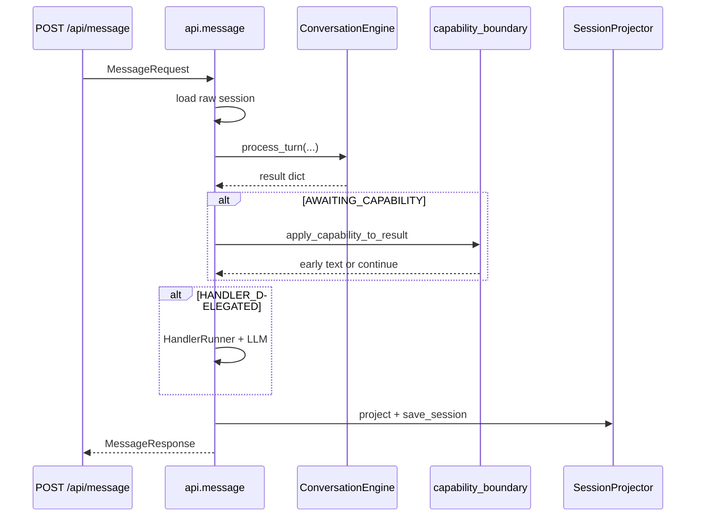
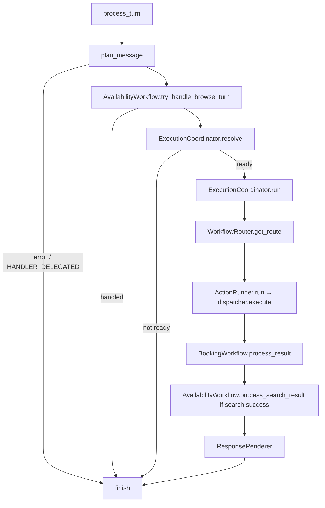
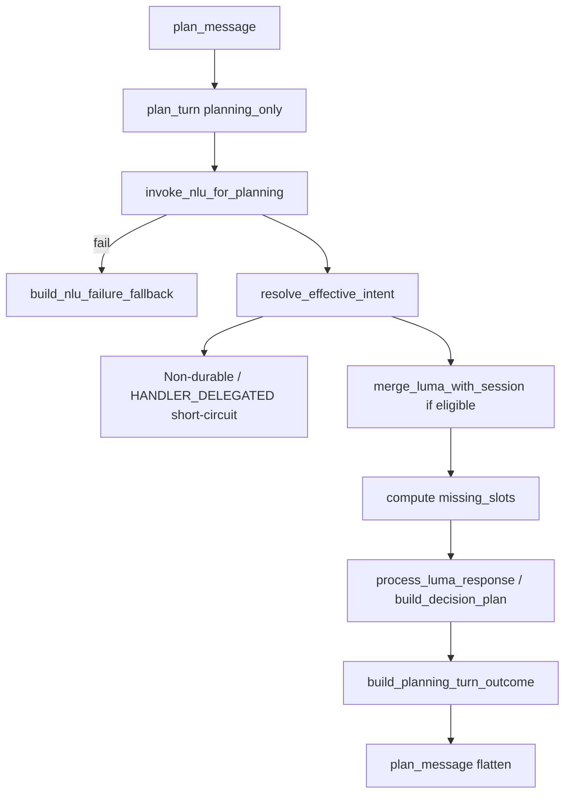
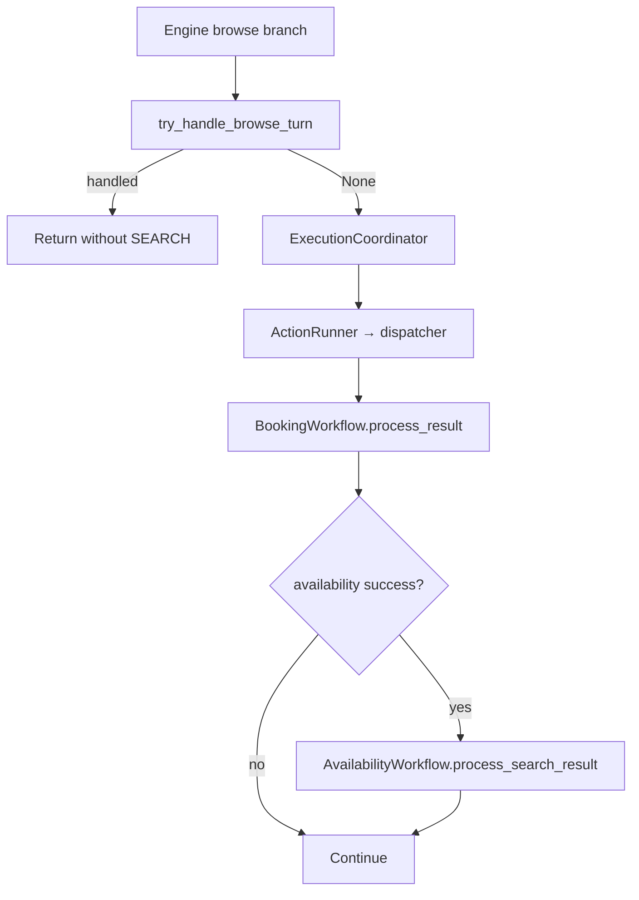
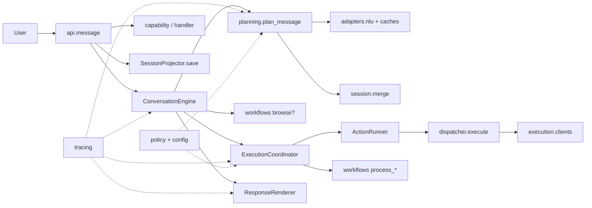

# Core Architecture Summary

Authoritative, current-state description of every major package under `src/core`.  
This document is the source for package-level README generation.

**Scope:** production architecture only. Historical packages (`orchestration/`, `routing/`) are absent from the live tree and are not described.

**Durable turn stages:** Planning → Execution → Rendering.  
**Turn owner:** `ConversationEngine.process_turn`.

---

# Package: api

## Purpose

HTTP and application boundary for Core. Loads session, invokes `ConversationEngine`, then owns post-turn concerns the engine does not: capability activation, handler delegation (e.g. RAG), session persistence, and optional Decision Trace response fields.

## Owns

- FastAPI application and `/api/message` HTTP contract
- Request/response models (`MessageRequest`, `MessageResponse`)
- Session load and save for the HTTP turn
- Capability boundary (activate / complete / early return)
- Handler delegation after `HANDLER_DELEGATED`
- Compat entry `handle_message` (session-load shim → engine)
- Process-level wiring of availability/booking clients for HTTP

## Does NOT own

- Turn sequencing (planning → execution → rendering)
- Session merge, intent resolution, business facts
- Tool dispatch or booking/availability HTTP semantics
- Plan construction (`plan.action`, missing slots)
- Eligibility decisions

## Entry points

| Symbol | Production callers | Input | Output |
|--------|-------------------|-------|--------|
| `post_message` (`message.py`) | FastAPI route `/api/message`; HTTP clients (e.g. `chat.py`) | `MessageRequest` | `MessageResponse` |
| `handle_message` (`compat.py`) | `core.app.process_message`; packages re-exporting `core.api` | text, user_id, optional clients/`session_store` | Engine result dict |
| `apply_capability_to_result` / `build_capability_context` | `message.py`; `core.api` re-exports | Engine result + capability runner | Early response or mutated outcome |
| `app` / health (`main.py`) | `python -m core.api.main` / ASGI servers | — | FastAPI app |

## Processing flow



## Internal structure

| Module | Responsibility | Visibility | Production callers |
|--------|----------------|------------|--------------------|
| `__init__.py` | Re-exports capability helpers + `handle_message` | Public | Importers of `core.api` |
| `main.py` | FastAPI app, logging, `/health` | Public server | Process entry |
| `message.py` | Production HTTP turn pipeline | Public HTTP | FastAPI |
| `compat.py` | Session-load fallbacks → `ConversationEngine` | Compat public | `app.py`, harness-style callers |
| `capability_boundary.py` | Capability context, invoke, fact merge, early text | Public helpers | `message.py` |

## Inputs

- `user_id`, `text`, optional `organization_id` / timezone / transaction id
- Raw session from store
- Injected or module-level availability/booking clients

## Outputs

- `MessageResponse` (`success`, `outcome`, `text`, errors, optional traces)
- Side effect: `save_session` for selected outcome statuses

## Collaborators

**Incoming:** HTTP clients, `chat.py`, `core.app` (compat).

**Outgoing:** `engine`, `session` (manager, projector), `execution.clients`, `rendering`, `tracing`, `extensions.*`, `adapters.nlu.conversation_memory`.

## Extension points

- Register capabilities / handlers via extensions bootstrap (`organization_id`)
- CapabilityRunner / HandlerRunner optional ImportError paths
- Trace enablement via env / query / header (`DIALOGCART_TRACE_*`)

## Common mistakes

- Treating `handle_message` as the production HTTP path (HTTP uses `_engine.process_turn` directly)
- Filtering session before handing it to the engine (engine receives raw session)
- Persisting durable state inside the engine instead of API/`SessionProjector`
- Growing turn-lifecycle branches in `compat.py`

## Overall package health

**7/10** — Clear boundary and correct engine ownership. Drag: large `message.py`, dual entry surfaces (HTTP vs compat), residual comments that still describe pre-engine ownership.

---

# Package: engine

## Purpose

Production turn owner. Sequences Planning → (browse branch) → Execution eligibility/run → Rendering, with `StageRunner` observability. Does not merge NLU/session or call booking APIs itself.

## Owns

- Turn lifecycle (`ConversationEngine.process_turn`)
- Browse short-circuit wiring
- Execution gate + dispatch coordination (`ExecutionCoordinator`)
- Non-execute / missing-client response shaping
- Instantiation of `ActionRunner`, domain workflows, `ResponseRenderer`, `WorkflowRouter`

## Does NOT own

- NLU invoke, session merge, plan construction
- Session persistence
- Capability / handler runners
- Domain tool HTTP semantics
- Policy YAML / business-fact registry

## Entry points

| Symbol | Production callers | Input | Output |
|--------|-------------------|-------|--------|
| `ConversationEngine.process_turn` | `api.message`, `api.compat` | text, user_id, session, clients, store, org | Result dict |
| `ConversationEngine.plan_turn` | Thin wrapper | Planning subset | Flat planning dict via `plan_message` |
| `ConversationEngine.handle_turn` | Alias of `process_turn` | same | same |
| `ExecutionCoordinator.resolve` / `run` | `ConversationEngine` only | plan + clients | Gate / run results |
| `build_*` (`outcome_builder`) | Coordinator; `planning_outcome`; browse pagination | plan/decision | Outcome / response envelopes |

## Processing flow



## Internal structure

| Module | Responsibility | Visibility | Production callers |
|--------|----------------|------------|--------------------|
| `__init__.py` | Package marker | Internal | — |
| `conversation_engine.py` | Turn orchestration owner | **Public** | `api.message`, `api.compat` |
| `execution_coordinator.py` | Eligibility, prep, ActionRunner, workflow post-hooks | Engine-internal | `ConversationEngine` |
| `outcome_builder.py` | Shared outcome/response dict construction | Shared helper | Coordinator, planning, pagination |

## Inputs

User text, session, optional Luma/org clients, availability/booking clients, session_store, `organization_id`.

## Outputs

Dict with `success`, `outcome`/`result`, often `plan`, `_merged_luma_response`, optional `text` / errors. Browse may return a full turn result without tool dispatch.

## Collaborators

**Incoming:** `api`.

**Outgoing:** `planning.planning_service`, `execution.action_runner`, `workflows.*`, `rendering.response_renderer`, `tracing.stage_runner`, `policy.intent_policy`, `planning.temporal_proposal` / `time_resolution`, `config.org_resolver`, `execution.catalog_resolver`.

## Extension points

- Injected clients / session_store / luma_client / organization_client
- Policy-driven execution steps (`intent_policy.yaml`)
- Domain post-hooks via workflows (not alternate dispatchers)

## Common mistakes

- Re-implementing planning or tool dispatch inside the engine
- Treating browse as a durable fourth stage
- Inferring conversation phase from `plan.action`
- Persisting from the engine
- Restoring workflow methods that initiate `dispatcher.execute`

## Overall package health

**8.5/10** — Best aligned with the constitution: small surface, clear stages, coordinator extraction. Soft spots: nested imports; some booking/search prep still in the coordinator rather than domain workflows.

---

# Package: planning

## Purpose

Planning-only stage: NLU → intent resolution → session merge → missing slots → decision plan → planning outcome envelope. Public contract is `plan_message`; implementation is `planner.plan_turn(..., planning_only=True)`. Performs no tool execution.

## Owns

- Per-turn planning pipeline
- Effective intent, merge gating (with session), facts → slots
- `missing_slots`, business facts, `plan.action` selection
- Temporal proposals and time-resolution helpers (shared consumers elsewhere)
- Handler-delegation **status** signal (`HANDLER_DELEGATED`)

## Does NOT own

- Tool execution / eligibility to run tools
- Durable session persistence
- Capability runner / HTTP
- Browse execution (engine + availability workflow)
- Handler execution (API + extensions)

## Entry points

| Symbol | Production callers | Input | Output |
|--------|-------------------|-------|--------|
| `plan_message` (`planning_service.py`) | `ConversationEngine._planning` / `.plan_turn` | text, user_id, session, clients, org | Flat plan dict + `_decision`, proposals, `_merged_luma_response` |
| `plan_turn` (`planner/turn_planner.py`) | `plan_message` only (prod) | Full planning args + `planning_only=True` | Nested success/outcome |
| `build_decision_plan` | Via NLU processor / planner path | Merged Luma + session | Plan dict |
| `build_planning_turn_outcome` | `plan_turn` | Decision + plan | Envelope for engine |

## Processing flow



## Internal structure

| Module | Responsibility | Visibility | Production callers |
|--------|----------------|------------|--------------------|
| `__init__.py` | Exports `plan_message` | Public | — |
| `planning_service.py` | Stable flat planning API | **Public** | Engine |
| `planner/turn_planner.py` | Planning turn sequencer | Internal | `plan_message` |
| `planner/intent_resolution.py` | Effective intent + durable recovery | Internal | `turn_planner` |
| `planner/plan_builder.py` | Policy-driven decision plan | Internal | NLU processor / planner |
| `planner/missing_slots.py` | Required/missing slots from policy | Shared | turn_planner, session, tracing |
| `nlu_invocation.py` | Luma call + contract check | Internal | `turn_planner` |
| `nlu_failure_fallback.py` | NLU failure → explicit session replay fallback | Internal | `turn_planner` |
| `planning_outcome.py` | Flatten / AWAITING envelopes; clarification text inject | Internal | `turn_planner` |
| `turn_state.py` | Slot completeness / READY invariants | Shared | `adapters.nlu.luma_response_processor` |
| `luma_facts_adapter.py` | Facts → Core slots | Shared | planner, session, temporal |
| `temporal_proposal.py` | Proposals vs durable datetime | Shared | session, engine, workflows, facts |
| `time_resolution.py` | Post-search TIME_MATCH_* | Shared | engine, rendering, workflows, merge |
| `facts/business_fact_registry.py` | Runtime business facts for policy | Shared | plan_builder, tracing |
| `policy/action_policy.py` | Required slots / plan_intent façade over yaml | Shared | turn_state, session, plan_builder |

NLU failure fallback outcomes replay recoverable session state without applying
the current message. They expose `recovered=true`, `message_applied=false`, and
`recovery_reason` (`upstream_error`, `empty_response`, or `contract_violation`).
| `policy/handler_router.py` | Intent → handler (`intent_handlers.yaml`) | Internal | `turn_planner` |
| `policy/base_intents.py` | `CORE_BASE_INTENTS` / `is_core_intent` | Shared | intent_resolution |
| `policy/intent_router.py` | Legacy intent → action-name map | Shared | `luma_response_processor` |

## Inputs

Utterance, user_id, session_state, optional Luma/org/catalog clients, organization_id.

## Outputs

`intent_name`, `status`, `stage`, `action`, `slots`, `missing_slots`, `plan{}`, `_decision`, optional proposals / `text` / handler fields / `_merged_luma_response`.

## Collaborators

**Incoming:** `engine` (via `plan_message`).

**Outgoing:** `adapters` (NLU, caches, clients), `session`, `policy.intent_policy`, `engine.outcome_builder`, `rendering` (clarification inject), `workflows.availability.fingerprint`, `config`, `tracing`.

## Extension points

- `config/intent_policy.yaml` (slots, execution steps, durability)
- `planning/policy/intent_handlers.yaml` (non-core → `HANDLER_DELEGATED`)
- Fact registry + policy `requires` for sequencing without intent-specific planner branches
- NLU client injection on `plan_message` / `plan_turn`

## Common mistakes

- Calling `plan_turn` expecting tool execution
- Fabricating durable date/time from proposals without bind/availability
- Using `plan.action` as conversation phase
- Skipping `missing_slots` before `process_luma_response`
- Putting new booking sequencing in `turn_planner` instead of facts + policy
- Relying on `intent_router` action names as execution identity (policy selects `plan.action`)

## Overall package health

**6.5/10** — Correct public seam (`plan_message` → planner). Drag: very large `turn_planner`, shared temporal megamodule, legacy `intent_router` / `action_policy` façades, planning_outcome still calling private rendering injectors.

---

# Package: execution

## Purpose

Perform side-effecting availability/booking API calls after planning selects `plan.action`. Map plan slots → client I/O → normalized execution payloads. Owns the sole production tool-dispatch path via `ActionRunner` → `dispatcher.execute`.

## Owns

- Action routing for supported tools (`SEARCH_AVAILABILITY`, confirm/cancel/modify/hold/finalize/fetch, …)
- HTTP clients for availability and booking
- SKU → catalog id resolution at call time
- Response normalization for tool results

## Does NOT own

- Eligibility / whether to run (`ExecutionCoordinator`)
- Session merge/persist / confirmation gate
- Presentation, browse, fingerprint trust
- Selection of `plan.action` (planner/policy)

## Entry points

| Symbol | Production callers | Input | Output |
|--------|-------------------|-------|--------|
| `ActionRunner.run` | `ExecutionCoordinator.run` | `plan`, optional clients | Execution result dict |
| `dispatcher.execute` | `ActionRunner` only (prod) | same | same |
| `AvailabilityClient` / `BookingClient` | `api/message` constructs; coordinator injects; dispatcher invokes | API args | HTTP JSON |
| `catalog_resolver.*` | Coordinator; dispatcher | org/catalog or SKU | id maps / resolved ids |

## Processing flow

1. Planner sets `plan.action` (+ slots).
2. Coordinator gates eligibility, binds client from policy `client`, preps slots/SKU map.
3. `ActionRunner.run` → `execute(plan, …)`.
4. Action-specific `_execute_*` validates slots, calls client, normalizes.
5. Result returns to coordinator for workflow post-hooks.

## Internal structure

| Module | Responsibility | Visibility | Production callers |
|--------|----------------|------------|--------------------|
| `__init__.py` | Re-exports `ActionRunner` | Public | Package consumers |
| `action_runner.py` | Thin façade → `dispatcher.execute` | Public | Engine / coordinator |
| `dispatcher.py` | Action switchboard + `_execute_*` | Package core | `ActionRunner` |
| `catalog_resolver.py` | SKU ↔ catalog id | Helpers | Coordinator, dispatcher |
| `clients/base_client.py` | Shared httpx + `UpstreamError` | Internal base | Clients |
| `clients/availability_client.py` | Availability endpoints | Public | Dispatcher, API bootstrap |
| `clients/booking_client.py` | Booking create/get/cancel/update/confirm | Public | Dispatcher, API bootstrap |
| `clients/__init__.py` | Exports | Public | Imports |

## Inputs

`plan` with `action`, `slots`, `intent_name`, optional `time_constraint`, `sku_to_catalog_id`, `facts`.

## Outputs

Availability `{type, status, slots}` or booking `{status, booking|cancellation, facts, booking_id?}`. Raises on hard failures.

## Collaborators

**Incoming:** `engine.ExecutionCoordinator`.

**Outgoing:** HTTP backends; `adapters.cache` / catalog (SKU load); `tracing.availability`; result consumed by `workflows`.

## Extension points

- New actions: branch in `dispatcher.execute` + `_execute_*` (+ policy step)
- New HTTP ops: client methods
- Client injection via `ActionRunner` / kwargs

## Common mistakes

- Calling dispatcher/clients from planner or NLU
- Treating ActionRunner as coordination (eligibility stays in engine)
- Forgetting `sku_to_catalog_id` for string SKUs
- Re-adding tool initiation on domain workflows

## Overall package health

**7/10** — Clear single entry after cleanup. Drag: large procedural `dispatcher.py`; `ActionRunner` is a one-line façade that adds no behaviour today.

---

# Package: workflows

## Purpose

Domain post-processing and availability presentation control after (or instead of) tool dispatch: browse/pagination, fingerprints, search-result session enrichment, booking slot propagation. Does not call booking/availability APIs.

## Owns

- Domain route selection for post-processing (`WorkflowRouter.get_route`)
- Browse short-circuit over cached search
- Fingerprint compute/match for search criteria
- Post-search: fingerprint, time-match bind, presented payloads
- Booking `process_result` slot writes (`booking_id`, hold fields)

## Does NOT own

- Tool dispatch / HTTP
- Planning / `plan.action` selection
- Durable session schema as a whole
- Confirmation policy authority (may set pending via session gate)
- Workflow construction via router (engine constructs instances)

## Entry points

| Symbol | Production callers | Input | Output |
|--------|-------------------|-------|--------|
| `WorkflowRouter.get_route` | `ExecutionCoordinator.run` | policy `client` string | `"availability"` / `"booking"` / `None` |
| `AvailabilityWorkflow.try_handle_browse_turn` | `ConversationEngine._browse` | plan, session, store, user | Full turn result or `None` |
| `AvailabilityWorkflow.process_search_result` | `ExecutionCoordinator.run` | exec result + plan/slots/session | `(slots, session_state)` |
| `AvailabilityWorkflow.compute_fingerprint` / `slots_match_fingerprint` | Available API | slots / FP | str / bool |
| `BookingWorkflow.process_result` | Coordinator after successful tool run | exec result, plan, slots, action | updated slots |

Supporting modules (`fingerprint`, `browse`, `pagination`) are used by planning facts, session merge, confirmation, and the availability workflow façade.

## Processing flow



## Internal structure

| Module | Responsibility | Visibility | Production callers |
|--------|----------------|------------|--------------------|
| `__init__.py` | Package marker | — | — |
| `router.py` | `client` → route name only | Public | Coordinator |
| `availability/workflow.py` | Domain façade (browse + post-search) | Public | Engine, coordinator |
| `availability/fingerprint.py` | Search-criteria hash | Shared | Workflow, planning, adapters, confirmation |
| `availability/pagination.py` | Browse turn handler | Via workflow | Workflow |
| `availability/browse.py` | Browse operation signals | Helpers | Merge, pagination |
| `booking/workflow.py` | Post-commit slot propagation | Public | Coordinator |

## Inputs

Browse: plan + session cache.  
Post-search: execution result + plan/slots/session.  
Booking process: execution result + action.

## Outputs

Browse: optional full turn response.  
Post-search: mutated execution/plan; rebound slots/session (`last_execution_result`, `presented_availability`, `availability_presentation`, fingerprint, optional resolved datetime + pending confirmation).  
Booking: updated slots/`plan["slots"]`.

## Collaborators

**Incoming:** `engine`.

**Outgoing:** `session` (`_persist_to_session`, confirmation gate), `planning` (temporal/time resolution), `rendering` (presentation builders), `tracing.browse`.

## Extension points

- New domain: extend `_CLIENT_TO_ROUTE` + new `*Workflow.process_*`; wire in coordinator
- Fingerprint criteria keys
- Browse signal normalization

## Common mistakes

- Putting tool calls on workflows
- Invalidating fingerprint from time selection / page index
- Browse that triggers search
- Expecting router to construct workflows
- Assuming `BookingWorkflow.process_result` only runs on booking routes (coordinator always calls it)

## Overall package health

**8/10** — Cleanest boundary relative to recent cleanup: no tool initiation, thin router, clear post-hooks. Soft spots: fat availability post-search orchestrating planning+rendering+session; text browse fallback tension with structured-operation contract.

---

# Package: session

## Purpose

Single owner of durable conversational booking state: Redis load/save, NLU↔session merge, invalidation, confirmation gate lifecycle, missing-slot derivation for persist, projection of turn outcomes into the next session.

## Owns

- Persistent session shape and Redis I/O
- Merge eligibility and additive slot merge
- Invalidation registry (explicit clears)
- `confirmation_state` gate classify/set/consume
- Persist/project from outcomes
- Mid-turn key flush used by availability workflows (`session_ops`)

## Does NOT own

- Planning sequencing / policy steps
- Tool execution / HTTP
- Availability presentation paging logic (workflows write via ops)
- Selecting `plan.action`
- NLU classification

## Entry points

| Symbol | Production callers | Input | Output |
|--------|-------------------|-------|--------|
| `get_session` / `save_session` / `clear_session` | `api/message`, compat, planners/extensions | user_id [, state] | session dict / None |
| `should_merge_session_context` / `merge_luma_with_session` | `planning/planner/turn_planner` | session + luma | eligibility / merged luma |
| `build_session_state_from_outcome` | `SessionProjector`, persist path | outcome + status + prior | next session or clear |
| `SessionProjector.project` | `api/message` | same | session |
| Confirmation gate helpers | Planner, plan_builder, facts, workflows, invalidation | luma + session | enum / state |
| `apply_invalidation` | Planner, merge, extensions | trigger + session | cleared session |
| `is_durable_intent` | Planning, adapters, merge, persist, tracing | intent name | bool |
| `_persist_to_session` | Availability workflow + pagination | key/value mid-turn | updated session |

## Processing flow

1. API loads session (`session_manager`).
2. Planning: confirmation classify → invalidation if needed → `should_merge` → `merge_luma_with_session` → effective / missing slots.
3. Execution/browse may mid-write keys via `session_ops._persist_to_session`.
4. After turn: API `SessionProjector` → `build_session_state_from_outcome` → `save_session`.

## Internal structure

| Module | Responsibility | Visibility | Production callers |
|--------|----------------|------------|--------------------|
| `session_manager.py` | Redis get/save/clear + normalize | Public | API, extensions |
| `merge.py` | NLU + session merge pipeline | Public entry | turn_planner |
| `persist.py` | Outcome → durable session | Public | Projector |
| `session_projector.py` | API-facing wrap of persist | Public | `api/message` |
| `session_ops.py` | Mid-turn key flush | Internal `_` used by workflows | Workflows |
| `confirmation_gate.py` | pending/confirmed/classify/revision | Public | Planner, facts, merge, workflows |
| `invalidation.py` | Triggered clears | Public | Planner, merge, extensions |
| `durable_intents.py` | Policy-backed durable flag + slot filter | Public | Many |
| `effective_slots.py` | Merge-time effective collected slots | Package-internal | Merge, turn_planner |
| `missing_slots.py` | Persist-time missing recomputation | Package | Persist |
| `slot_operations.py` | Domain/intent filter & promote | Public | Merge, effective_slots |
| `intent_persist.py` | Durable intent + clear-on-executed rules | Package | Persist |
| `appointment_extensions.py` | CREATE_APPOINTMENT persist extras | Package | Persist |
| `schema.py` | Guards, serializable facts | Package | Merge, persist, manager |

## Inputs

Raw luma + persisted session (merge); turn outcome + prior session (persist); confirmation signals.

## Outputs

Merged luma response; next Redis document (or cleared); confirmation gate values.

## Collaborators

**Incoming:** `planning` (primary), `api` (I/O lifecycle), `workflows` (mid-turn).

**Outgoing:** `policy/intent_policy` (durable/missing), `workflows.availability.browse` from merge.

## Extension points

- Invalidation triggers + handlers
- Persist hooks via `appointment_extensions` / `intent_persist`
- Confirmation through gate helpers only
- Slot filtering via `slot_operations` + durable intent policy

## Common mistakes

- Merging on `status` instead of durable intent
- Writing durable slots outside persist/invalidation
- Leaving `confirmation_state` after successful commit
- Using presentation keys as booking truth
- Clearing session visibility mid-turn (capability facts must remain)

## Overall package health

**6.5/10** — Correct ownership and strong invariants. Drag: very large `merge.py`, dual write paths (mid-turn ops vs end-of-turn projector), intertwined persist extensions.

---

# Package: rendering

## Purpose

Turn-level user-facing text: LLM replies for clarification, availability, booking outcomes, greetings; deterministic confirmation/revision strings; clarification reason → template key mapping. Best-effort — must never fail the turn.

## Owns

- LLM call (`render_llm`) and render-request builders
- Presentation shaping for availability pages/slots
- Clarification reason → template key (`clarification_router` + YAML)
- Mutating `result["text"]` / `outcome["text"]` in place

## Does NOT own

- Session, planning, execution eligibility
- Deciding what to ask or whether to search
- Business outcome shape (status/stage/action)

## Entry points

| Symbol | Production callers | Input | Output |
|--------|-------------------|-------|--------|
| `ResponseRenderer` | `ConversationEngine._rendering` | plan + execution + session | Mutates `result` text |
| `_inject_rendering_text` / `_inject_system_text` | `planning_outcome` (private imports) | decision + session | Clarification / greeting text |
| Availability builders (`dedupe_*`, `build_presented_*`, …) | Workflows, session, planning | slots / page state | Presentation structs / LLM requests |
| `render_llm` | Renderers; `api/message`; capability boundary | `LlmRenderRequest` | `str` (fallback on failure) |
| `get_template_key` | `adapters/nlu/luma_response_processor` | reason + domain | Template key |
| Confirmation render helpers | Turn planner / planning_outcome | slots | Deterministic strings |

## Processing flow

```
Plan/execution artifacts
  → ResponseRenderer (post-execute) and/or planning_outcome _inject_* (clarify/system)
      → specialty builders
          → LlmRenderRequest → render_llm
              → result["text"] (best-effort)
```

## Internal structure

| Module | Responsibility | Visibility | Production callers |
|--------|----------------|------------|--------------------|
| `__init__.py` | Re-exports LLM + availability builders | Public | Imports |
| `response_renderer.py` | Facade + `_inject_*` helpers | Public class; private injectors also used | Engine; planning_outcome |
| `llm_renderer.py` | `LlmRenderRequest`, `render_llm` | Public | Renderers, API |
| `availability_renderer.py` | Dedupe/paginate/summarize + availability requests | Public | Workflows, session, planning |
| `booking_confirmation_renderer.py` | Deterministic confirm/reject/revision | Public | Planning |
| `clarification_router.py` | Reason → template key | Public | NLU adapter |
| `clarification_templates.yaml` | Mapping config | Config | Router |

## Inputs

Decision/plan dicts, execution/outcome payloads, session (`messages`, `slot_attempts`), org structured_context, clarification reasons.

## Outputs

`str` text on result; presentation side structs; template keys.

## Collaborators

**Incoming:** Engine, planning_outcome, availability workflow/pagination, turn_planner, NLU adapter, API.

**Outgoing:** Anthropic; tracing `measure_stage("renderer")`; org facts for business context.

## Extension points

- New reply kinds → `ResponseRenderer` methods
- New availability presentation → `availability_renderer`
- New clarification reasons → `clarification_templates.yaml`
- LLM model via env (`LLM_RENDER_MODEL`, `ANTHROPIC_API_KEY`)

## Common mistakes

- Raising from the render path
- Inferring conversation phase from `plan.action`
- Using browse helpers to mutate durable slots
- Calling private `_inject_*` instead of consolidating on `ResponseRenderer`
- Treating `clarification_router` as conversational planning

## Overall package health

**6.5/10** — Clear constitutional role. Drag: dual entry paths (engine renderer vs planning injectors); `clarification_router` is a routing table housed under rendering; presentation helpers pulled into planning/session.

---

# Package: adapters

## Purpose

Outbound boundary of Core to external systems needed for understanding and tenant context: NLU HTTP, catalog/org HTTP, read-through caches, shared upstream errors. Not booking/availability execution (those live under `execution/clients`).

## Owns

- `LumaClient` HTTP (`/resolve`, `/notify_execution`)
- Contract assert + response interpretation (`process_luma_response`)
- Catalog and Organization HTTP clients
- Catalog and org-domain caches
- Shared `ContractViolation` / `UpstreamError`

## Does NOT own

- NLU pipeline internals (`nlu/` / `luma/` services)
- Session persistence / merge policy ownership
- Booking / availability / capability execution clients
- Planner sequencing (policy)

## Entry points

| Symbol | Production callers | Input | Output |
|--------|-------------------|-------|--------|
| `LumaClient.resolve` | `planning/nlu_invocation`, turn_planner defaults | user/text/domain/tenant/context | Raw NLU dict |
| `assert_luma_contract` | nlu_invocation | dict | None or `ContractViolation` |
| `process_luma_response` | Session merge / planner path | Validated Luma + domain + session | Decision/plan-shaped dict |
| Conversation memory helpers | nlu_invocation, `api/message` | session | NLU context; may mutate messages |
| `CatalogClient` / `OrganizationClient` | turn_planner, planning_service, compat, caches | org id | Catalog/org JSON |
| `catalog_cache` / `org_domain_cache` | turn_planner | org/domain | Cached snapshots |

## Processing flow

```
Planning turn
  → caches + Catalog/Org → tenant_context + domain
  → build_conversation_context(session)
  → LumaClient.resolve
  → assert_luma_contract
  → merge → process_luma_response → decision artifacts
```

## Internal structure

| Module | Responsibility | Visibility | Production callers |
|--------|----------------|------------|--------------------|
| `errors.py` | Typed upstream/contract errors | Public | API, clients, NLU |
| `nlu/luma_client.py` | HTTP NLU client | Public | Planning |
| `nlu/luma_contracts.py` | Contract checks | Public | nlu_invocation |
| `nlu/luma_response_processor.py` | Clarify/intent/plan interpretation | Public | Merge / planner |
| `nlu/conversation_memory.py` | Prior-turn context for NLU | Public | Planning, API |
| `clients/base_client.py` | Shared httpx | Internal | Clients |
| `clients/catalog_client.py` | Services / reservation catalog | Public | Planner, caches |
| `clients/organization_client.py` | Org details | Public | Planner, caches |
| `cache/catalog_cache.py` | TTL catalog cache | Public | Planner |
| `cache/org_domain_cache.py` | Org → domain | Public | Planner |

## Inputs

User utterance, org id, optional session for memory, tenant aliases.

## Outputs

NLU response dicts, decision plans from processor, catalog/org JSON, cached domain/catalog snapshots. Errors: `UpstreamError`, `ContractViolation`.

## Collaborators

**Incoming:** Planning, session merge, API compat/message.

**Outgoing:** NLU service, internal catalog/org APIs; rendering `clarification_router`; tracing stage timing; Redis/env config for caches.

## Extension points

- Swap/mock Luma/catalog/org at planning call sites
- Extend contract checks
- New tenant context fields via clients + cache keys
- Memory schema in `conversation_memory`

## Common mistakes

- Putting booking/availability HTTP in adapters
- Treating `process_luma_response` as sole planning owner
- Fabricating booking slots or instructing Core to search
- Reintroducing a customer client here

## Overall package health

**7.5/10** — Clean client/NLU/cache split after CustomerClient removal. Drag: oversized `luma_response_processor`; interpretation duties that blur with planning.

---

# Package: tracing

## Purpose

Primary orchestration debugging: append-only Decision Trace DAG (evidence → decision → mutation), orthogonal invariant stage checks, and stage lifecycle (`StageRunner`). Debug-only; production business return types stay unchanged when off.

## Owns

- Trace enablement, emit APIs, finalize, views, schema, CLI
- Stable `reason_code`s and subsystem emitters
- `StageRunner` turn/stage observability wiring
- Invariant stage checks (orthogonal dual path)

## Does NOT own

- Business return types / orchestration APIs
- NLU internal tracing
- Session truth or planner decisions
- Application logging replacement

## Entry points

| Symbol | Production callers | Input | Output |
|--------|-------------------|-------|--------|
| Enable / finalize / response fields | `api/message` | Request flags | Response `decision_trace*` fields |
| `StageRunner.turn` | `ConversationEngine.process_turn` | Turn context | Wrapped finish + attach |
| `emit_evidence` / `decide` / `emit_mutation` | Domain emitters + owning subsystems | Nodes | In-memory `TurnTrace` |
| Domain emitters | Session, planning, workflows, execution | Decision-specific I/O | Trace nodes |
| `measure_stage` | nlu_invocation, turn_planner, response_renderer | Timing buckets | Stage metrics |
| `python -m core.tracing.decision_trace_cli` | Offline | Saved JSON | Summary/mermaid |

## Processing flow

```
Enable (env / ?trace= / header)
  → StageRunner.turn + TurnTrace.begin
  → Subsystems emit at seams
  → finish / API finalize
  → views → MessageResponse fields + optional server log
```

## Internal structure

| Module | Responsibility | Visibility | Production callers |
|--------|----------------|------------|--------------------|
| `__init__.py` | Public facade exports | Public | Importers |
| `decision_trace.py` | Core TurnTrace + emit APIs | Public | Many |
| `reason_codes.py` | Stable machine codes | Public | Emitters |
| `spine.py` | Eligibility / persist / turn outcome | Public | Engine path |
| `execution_return.py` | Wrap results with execution spine | Public | Execution seams |
| `planner.py` / `facts.py` / `fingerprint.py` / `merge.py` / `browse.py` / `confirmation.py` / `binding.py` | Domain emitters | Public | Owning subsystems |
| `availability.py` | SEARCH_AVAILABILITY evidence | Public | Dispatcher/clients |
| `stage_runner.py` | Turn/stage lifecycle | Public | Engine |
| `stage_checks.py` | Per-stage invariant predicates | Internal/public | StageRunner |
| `invariant_trace.py` | Older invariant framework | Public (legacy dual path) | Enable path |
| `views.py` / `reasoning.py` / `formatters.py` | Projections | Public | API finalize / CLI |
| `schema_validation.py` + `schemas/` | JSON Schema | Public | Finalize |
| `server_log.py` | Compact turn/trace logging | Public | API |
| `decision_trace_cli.py` | Offline viewer | CLI | Operators |

## Inputs

Flags from HTTP/env; evidence facts and decision candidates from owning code.

## Outputs

Frozen forensic graph; view projections; optional invariant trace; stage timings. No business side effects when disabled.

## Collaborators

**Incoming:** API, engine, session, planning, workflows, execution, rendering (timing).

**Outgoing:** None that alter business outcomes (observability only).

## Extension points

- New decisions: emit from owning subsystem + stable node id + `reason_codes`
- New views in `views.py` / `reasoning.py`
- Schema under `schemas/`
- Enable via env / header / `?trace=`

## Common mistakes

- Bracket-prefixed logger debugging instead of Decision Trace
- Emitting from the wrong owner
- Extending the framework “just in case”
- Asserting on traces when tracing is off
- Letting tracing dictate business APIs

## Overall package health

**9/10** — Shipped, documented, wired through the turn spine. Remaining debt is invariant dual-emit / migration hygiene, not capability gaps.

---

# Supporting packages (collaborators)

Not requested as full package chapters, but required for ownership clarity:

| Package | Role |
|---------|------|
| `config/` | Declarative assets: `intent_policy.yaml`, `capabilities.yaml`; `org_resolver.py`, `capabilities_loader.py`. (`intent_handlers.yaml` lives under `planning/policy/`.) |
| `policy/` | Runtime loaders of `intent_policy.yaml` (`intent_policy.py`): required slots, execution steps, step selection for planning/eligibility. |

---

# Overall Core Architecture

## Overall request flow



Canonical execution path:

`ConversationEngine → ExecutionCoordinator → ActionRunner → dispatcher.execute → BookingWorkflow.process_result → AvailabilityWorkflow.process_search_result → ResponseRenderer`

## Package dependency graph (conceptual)

```
api
 ├─ engine
 │   ├─ planning ── adapters, session, policy/config, rendering (inject), workflows.fingerprint
 │   ├─ execution ── adapters.cache (SKU), tracing
 │   ├─ workflows ── session, planning(time/temporal), rendering, tracing
 │   ├─ rendering ── tracing
 │   └─ tracing
 ├─ session
 ├─ rendering
 ├─ tracing
 └─ extensions (capabilities/handlers)
```

## Ownership boundaries

| Concern | Owner |
|---------|-------|
| HTTP + persist + capabilities/handlers | `api` |
| Turn sequencing | `engine` |
| Plan / facts / missing slots | `planning` (+ `policy`/`config`) |
| Tool HTTP | `execution` |
| Domain post-process / browse | `workflows` |
| Durable booking state | `session` |
| User-facing text | `rendering` |
| NLU + tenant context HTTP | `adapters` |
| Observability | `tracing` (orthogonal) |

## Layering

1. **Boundary:** `api`, `adapters`, `execution/clients`
2. **Orchestration:** `engine`
3. **Domain stages:** `planning` → `execution` + `workflows` → `rendering`
4. **Durable state:** `session`
5. **Rules:** `config` + `policy`
6. **Observability:** `tracing`

## Remaining architectural smells

1. **`ActionRunner` is a one-line façade** over `dispatcher.execute` — no behavioural value today.
2. **`dispatcher.py` is a large procedural monolith** relative to the thin package boundary.
3. **`turn_planner.py` / `merge.py` / `luma_response_processor.py` are still oversized** ownership magnets.
4. **Rendering split brain:** `ResponseRenderer` (engine) vs private `_inject_*` (planning_outcome).
5. **`clarification_router` lives under rendering** but is a reason→id table used by NLU adaptation.
6. **`BookingWorkflow.process_result` always runs** after tool success, including pure availability searches (harmless no-op, confusing).
7. **Dual session write paths:** mid-turn `session_ops` vs end-of-turn `SessionProjector`.
8. **Legacy `intent_router` action-name map** still gates an NLU branch while policy owns real `plan.action`.
9. **Text browse fallback** still exists alongside structured `operation` contract language.
10. **`WorkflowRouter` still keys off policy `client`**, not `plan.action` (acceptable today; incomplete vs long-term action-first docs).

## Recommended README generation order

1. `engine` — turn owner; establishes language for all other READMEs  
2. `planning`  
3. `execution`  
4. `workflows`  
5. `session`  
6. `api`  
7. `adapters`  
8. `rendering`  
9. `tracing`  
10. Short `config` + `policy` companion notes (not full packages in this summary’s main body)

## Recommended diagram list

1. Overall request sequence (API → Engine → stages → persist)  
2. Planning pipeline (NLU → merge → plan)  
3. Execution path (Coordinator → ActionRunner → dispatcher → process_*)  
4. Availability browse short-circuit  
5. Session lifecycle (load → merge → mid-turn keys → project/save)  
6. Confirmation gate state machine  
7. Package dependency graph  
8. Decision Trace enablement / emit / view flow  

## Recommended long-term documentation structure

```
src/core/
  SUMMARY.md                 # this file — source of truth for package README drafts
  AGENTS.md                  # constitution / invariants
  README.md                  # short landing page linking SUMMARY + package READMEs
  <package>/README.md        # generated from SUMMARY sections; keep local examples only
  tracing/DECISION_TRACE.md  # keep specialized (already authoritative)
  docs/                      # deep dives / contracts only; must not contradict SUMMARY
```

Rules for package READMEs:

- Derive Purpose / Owns / Entry points / Collaborators from this SUMMARY
- Do not document deleted packages or “Phase N” aspirational code as if current
- Link Decision Trace docs from `tracing/README.md` rather than duplicating them
- Prefer sequence diagrams over prose for turn and execution flows

---

*Generated from live tree under `src/core` as of this audit. Absent on disk and excluded: `orchestration/`, `routing/`.*
