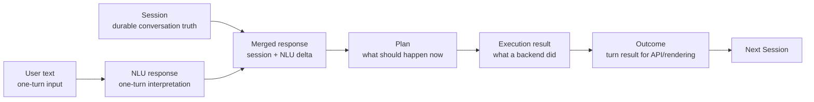
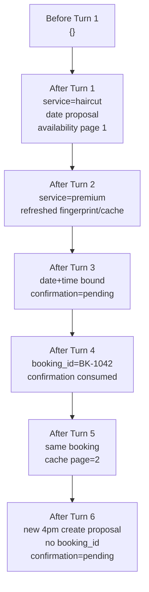
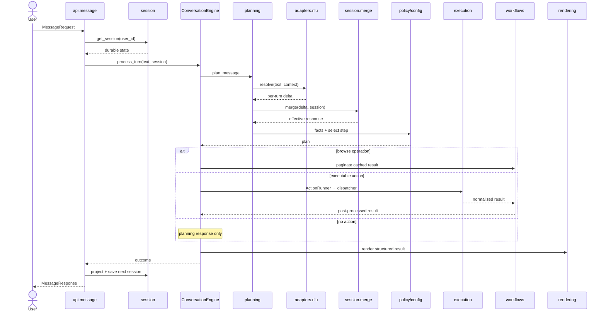
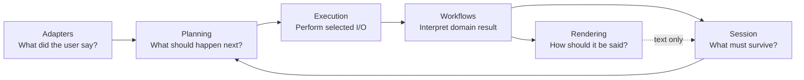
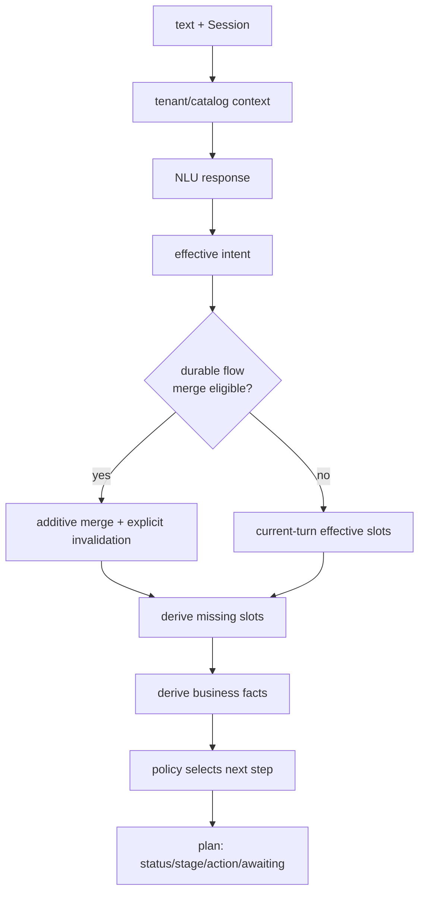
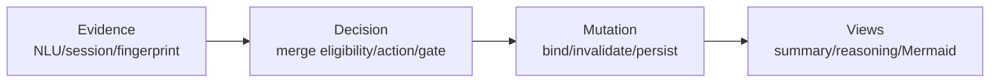

# Core Architecture: One Conversation, Six Turns

This guide follows one user through six requests. It is a guided debugger walkthrough of the current runtime under `src/core`, not a package catalog.

> [!NOTE]
> JSON values are representative snapshots, not complete payloads. Assume an organization timezone in which “tomorrow” resolves to `2026-07-16`, a catalog where `haircut` and `premium haircut` resolve to service IDs, and an availability backend that offers both 3pm and 4pm. Rendered wording is illustrative; the renderer may vary it.

## Contents

- [The runtime objects](#the-runtime-objects)
- [The whole conversation](#the-whole-conversation)
- [Turn 1 — Begin a durable booking](#turn-1)
- [Turn 2 — Merge a refinement](#turn-2)
- [Turn 3 — Bind a proposed time](#turn-3)
- [Turn 4 — Confirm and commit](#turn-4)
- [Turn 5 — Browse cached availability](#turn-5)
- [Turn 6 — Replan after a completed booking](#turn-6)
- [What the six turns reveal](#what-the-six-turns-reveal)
- [Code navigation map](#code-navigation-map)

---

## The runtime objects

The walkthrough follows six runtime objects. They are related, but they are not interchangeable.



<details>
<summary><strong>Object contracts</strong></summary>

- **NLU response** — stateless interpretation of the current utterance: intent, facts, entities, constraints, and optional availability operation. NLU does not own booking state.
- **Session** — persisted Core state across turns: durable intent, collected slots, proposals, confirmation state, availability cache, booking identifiers, and conversation memory.
- **Merged response** — an in-request processing view combining the session with the current NLU delta. It is not a second source of truth.
- **Plan** — ephemeral decision: `status`, `stage`, nullable `action`, `awaiting`, `missing_slots`, and business facts.
- **Execution result** — normalized availability or booking backend response.
- **Outcome** — engine result consumed by rendering and projected back into Session.

</details>

---

## The whole conversation

```mermaid
stateDiagram-v2
    [*] --> SearchingGeneric: Turn 1<br/>haircut + tomorrow proposal
    SearchingGeneric --> SearchingPremium: Turn 2<br/>service refined; search refreshed
    SearchingPremium --> Pending3pm: Turn 3<br/>3pm bound; confirmation pending
    Pending3pm --> Booked3pm: Turn 4<br/>confirmed; booking committed
    Booked3pm --> Booked3pmPage2: Turn 5<br/>cached results paginated
    Booked3pmPage2 --> Pending4pmNew: Turn 6<br/>new booking replanned for 4pm
```



The final transition matters: after Turn 4 there is no pending confirmation to revise. Successful commit consumes it. Turn 6 therefore begins a new booking plan; changing an existing booking would require a `MODIFY_BOOKING` turn with booking-identification semantics.

---

<a id="turn-1"></a>
# Turn 1

## User input

```text
Book me a haircut tomorrow
```

---

## What the system knows BEFORE this turn

```json
{}
```

There is no durable intent, no booking state, and no availability cache.

---

## Step-by-step execution

### HTTP

#### Called by

The client via `POST /api/message`.

#### Receives

- `MessageRequest`
- User and organization identifiers

#### What changes here

The API validates the request and establishes the boundary for one turn.

#### Produces

Arguments for session loading and the engine.

#### Calls next

Session load.

### Session load

#### Called by

HTTP API.

#### Receives

- `user_id`

#### What changes here

Nothing; the store returns no previous session.

#### Produces

An empty session view.

#### Calls next

`ConversationEngine`.

### ConversationEngine

#### Called by

HTTP API.

#### Receives

- User text
- Empty session
- Injected NLU, organization, availability, and booking clients

#### What changes here

The engine opens the traced turn and becomes the owner of stage order.

#### Produces

Planning input.

#### Calls next

Planning.

### Planning

#### Called by

`ConversationEngine`.

#### Receives

- Text and empty session
- Organization identity

#### What changes here

Planning resolves tenant/catalog context, invokes NLU, computes effective slots and missing slots, derives business facts, and selects a policy action. It does not call commerce backends.

#### Produces

A plan selecting exploratory `SEARCH_AVAILABILITY`.

#### Calls next

NLU, then merge, business facts, and decision internally; control returns to the engine.

### NLU

#### Called by

Planning.

#### Receives

- Current utterance
- Tenant aliases and booking mode
- Empty conversation context

#### What changes here

Nothing durable. Luma identifies `CREATE_APPOINTMENT`, the haircut service, and a relative date.

#### Produces

A per-turn NLU response.

#### Calls next

Merge.

### Merge

#### Called by

Planning.

#### Receives

- NLU response
- Empty session

#### What changes here

The service becomes an effective collected slot. “Tomorrow” remains a date proposal until an offered datetime is bound.

#### Produces

A merged processing view with `service_id`, `date_proposal`, and derived `missing_slots`.

#### Calls next

Business facts.

### Business facts

#### Called by

Plan builder.

#### Receives

- Effective slots
- Missing slots
- Session and merged NLU evidence

#### What changes here

Runtime booleans establish that search prerequisites are met and no trustworthy availability exists yet.

#### Produces

`availability_check_required=true`.

#### Calls next

Decision.

### Decision

#### Called by

Planning.

#### Receives

- Business facts
- `CREATE_APPOINTMENT` policy

#### What changes here

Policy allows search with only `service_id`, even though date/time are not yet durable. The plan becomes executable but non-committing.

#### Produces

`status=READY`, `action=SEARCH_AVAILABILITY`.

#### Calls next

Execution gate.

### Execution

#### Called by

`ConversationEngine` through `ExecutionCoordinator`.

#### Receives

- Plan
- Availability client
- Date proposal

#### What changes here

The gate verifies the exploratory step requirements. `ActionRunner` delegates to `dispatcher.execute`, which calls the availability backend.

#### Produces

A normalized availability result.

#### Calls next

Availability workflow.

### Workflow

#### Called by

`ExecutionCoordinator` after successful dispatch.

#### Receives

- Search result
- Plan and session view

#### What changes here

The workflow computes a fingerprint for the search criteria, creates the first presented page, and caches the full result. No user time is bound.

#### Produces

Availability presentation artifacts.

#### Calls next

Rendering.

### Rendering

#### Called by

`ConversationEngine`.

#### Receives

- Decision
- Availability result
- Session context

#### What changes here

The renderer turns structured offers into user-facing text. It does not change the decision.

#### Produces

A response showing available times.

#### Calls next

Session persistence.

### Session persistence

#### Called by

HTTP API after the engine returns.

#### Receives

- Outcome
- Merged response
- Previous empty session

#### What changes here

`SessionProjector` builds the next durable state. It persists the booking intent, service, proposal, conversation memory, and availability artifacts.

#### Produces

The first stored session.

#### Calls next

HTTP response.

---

## Object evolution

After NLU — the current utterance is understood, but nothing is durable yet:

```json
{
  "intent": {"name": "CREATE_APPOINTMENT"},
  "facts": {"service_id": "haircut"},
  "date_proposal": {"start": "2026-07-16"}
}
```

After merge — the service is collected; the relative date is still a proposal:

```json
{
  "slots": {"service_id": "haircut"},
  "date_proposal": {"start": "2026-07-16"},
  "missing_slots": ["date", "time"]
}
```

After business facts — search is required and policy prerequisites are satisfied:

```json
{
  "availability_check_required": true,
  "availability_ready": false
}
```

After planning — exploratory execution is selected:

```json
{
  "status": "READY",
  "stage": "AVAILABILITY",
  "action": "SEARCH_AVAILABILITY",
  "missing_slots": ["date", "time"]
}
```

After execution/workflow — a cache and first page now exist:

```json
{
  "last_execution_result": {
    "type": "availability",
    "status": "success",
    "slots": ["09:00", "10:00", "15:00", "16:00"]
  },
  "presented_availability": {
    "page_index": 0,
    "slots": ["09:00", "10:00", "15:00"]
  },
  "availability_fingerprint": "fp:haircut:2026-07-16"
}
```

After persistence — only durable/continuity fields survive:

```json
{
  "intent_name": "CREATE_APPOINTMENT",
  "status": "READY",
  "slots": {"service_id": "haircut"},
  "missing_slots": ["date", "time"],
  "date_proposal": {"start": "2026-07-16"},
  "availability_fingerprint": "fp:haircut:2026-07-16",
  "presented_availability": {"page_index": 0, "slots": ["09:00", "10:00", "15:00"]}
}
```

---

## Why this stage exists

Turn 1 establishes the separation that protects the architecture: NLU describes one utterance, Planning combines that evidence with policy to choose an action, Execution alone performs backend I/O, Workflows convert raw results into reusable domain state, Rendering produces text, and Persistence makes only selected state available to the next turn.

---

## Files involved

```text
api/message.py
engine/conversation_engine.py
planning/planning_service.py
planning/planner/turn_planner.py
planning/planner/plan_builder.py
execution/dispatcher.py
workflows/availability/workflow.py
rendering/response_renderer.py
session/persist.py
```

---

## Result

Response to user:

> “I found times for a haircut tomorrow, including 9:00am, 10:00am, and 3:00pm. Which works?”

Session after persistence:

```json
{
  "intent_name": "CREATE_APPOINTMENT",
  "slots": {"service_id": "haircut"},
  "date_proposal": {"start": "2026-07-16"},
  "missing_slots": ["date", "time"],
  "availability_fingerprint": "fp:haircut:2026-07-16",
  "presented_availability": {"page_index": 0, "slots": ["09:00", "10:00", "15:00"]}
}
```

---

<a id="turn-2"></a>
# Turn 2

## User input

```text
Premium haircut
```

---

## What the system knows BEFORE this turn

```json
{
  "intent_name": "CREATE_APPOINTMENT",
  "slots": {"service_id": "haircut"},
  "date_proposal": {"start": "2026-07-16"},
  "missing_slots": ["date", "time"],
  "availability_fingerprint": "fp:haircut:2026-07-16"
}
```

---

## Step-by-step execution

### HTTP and session load

#### Called by

The client.

#### Receives

- `Premium haircut`
- `user_id`

#### What changes here

The API loads the entire prior session without pre-filtering it.

#### Produces

Text plus durable conversation state.

#### Calls next

`ConversationEngine`.

### ConversationEngine

#### Called by

HTTP API.

#### Receives

- Current text
- Prior session

#### What changes here

The engine starts the same stage sequence; it does not interpret the refinement itself.

#### Produces

Planning input containing both current and prior state.

#### Calls next

Planning.

### NLU

#### Called by

Planning.

#### Receives

- Current utterance
- Conversation context saying a booking is active
- Catalog aliases

#### What changes here

Nothing durable. NLU resolves “Premium haircut” to the tenant’s specific service.

#### Produces

A per-turn service delta.

#### Calls next

Merge.

### Merge

#### Called by

Planning.

#### Receives

- Prior durable session
- Current service delta

#### What changes here

Merge preserves the durable appointment intent and date proposal while replacing the current service value. State is additive unless an explicit invalidation rule applies.

#### Produces

One effective conversational view.

#### Calls next

Business facts.

### Business facts and decision

#### Called by

Plan builder.

#### Receives

- Refined service
- Old availability fingerprint
- Date proposal

#### What changes here

The refined criteria no longer match the old fingerprint. Availability is not trusted, so policy selects a fresh exploratory search.

#### Produces

`SEARCH_AVAILABILITY` for the premium service.

#### Calls next

Execution.

### Execution and workflow

#### Called by

`ExecutionCoordinator`.

#### Receives

- Updated plan
- Availability client

#### What changes here

The dispatcher searches for the premium service. The workflow replaces the cached search, fingerprint, and first presented page.

#### Produces

Fresh premium-haircut availability.

#### Calls next

Rendering.

### Rendering

#### Called by

`ConversationEngine`.

#### Receives

- New search result
- Decision and conversation context

#### What changes here

Only response text is added.

#### Produces

Premium-haircut options.

#### Calls next

Session persistence.

### Session persistence

#### Called by

HTTP API.

#### Receives

- Turn outcome
- Prior session

#### What changes here

The session is rebuilt with the refined service while preserving the date proposal and replacing availability artifacts.

#### Produces

The next durable session.

#### Calls next

HTTP response.

---

## Object evolution

After NLU — only the refinement appears:

```json
{
  "intent": {"name": "CREATE_APPOINTMENT"},
  "slots": {"service_id": "premium-haircut"}
}
```

After merge — prior date context survives:

```json
{
  "slots": {"service_id": "premium-haircut"},
  "date_proposal": {"start": "2026-07-16"},
  "missing_slots": ["date", "time"]
}
```

After fingerprint evaluation — old evidence is stale:

```json
{
  "stored_fingerprint": "fp:haircut:2026-07-16",
  "current_fingerprint": "fp:premium-haircut:2026-07-16",
  "availability_ready": false
}
```

After planning:

```json
{
  "status": "READY",
  "action": "SEARCH_AVAILABILITY",
  "slots": {"service_id": "premium-haircut"}
}
```

After persistence — the old cache is replaced:

```json
{
  "slots": {"service_id": "premium-haircut"},
  "date_proposal": {"start": "2026-07-16"},
  "availability_fingerprint": "fp:premium-haircut:2026-07-16",
  "presented_availability": {"page_index": 0, "slots": ["13:00", "15:00", "16:00"]}
}
```

---

## Why this stage exists

Merge exists because the utterance “Premium haircut” is incomplete in isolation: the durable session supplies the active appointment intent and tomorrow proposal. Fingerprints then prevent Core from treating availability for the old service as evidence for the refined service.

---

## Files involved

```text
planning/planner/turn_planner.py
session/merge.py
planning/facts/business_fact_registry.py
workflows/availability/fingerprint.py
execution/dispatcher.py
session/persist.py
```

---

## Result

Response to user:

> “For a premium haircut tomorrow, I can offer 1:00pm, 3:00pm, or 4:00pm.”

Session after persistence:

```json
{
  "intent_name": "CREATE_APPOINTMENT",
  "slots": {"service_id": "premium-haircut"},
  "date_proposal": {"start": "2026-07-16"},
  "missing_slots": ["date", "time"],
  "availability_fingerprint": "fp:premium-haircut:2026-07-16",
  "presented_availability": {"page_index": 0, "slots": ["13:00", "15:00", "16:00"]}
}
```

---

<a id="turn-3"></a>
# Turn 3

## User input

```text
3pm
```

---

## What the system knows BEFORE this turn

```json
{
  "intent_name": "CREATE_APPOINTMENT",
  "slots": {"service_id": "premium-haircut"},
  "date_proposal": {"start": "2026-07-16"},
  "presented_availability": {
    "search_date": "2026-07-16",
    "slots": ["13:00", "15:00", "16:00"]
  },
  "confirmation_state": null
}
```

---

## Step-by-step execution

### HTTP, session load, and ConversationEngine

#### Called by

The client.

#### Receives

- `3pm`
- Prior booking session

#### What changes here

The API loads prior state and the engine opens the turn; neither guesses which date “3pm” belongs to.

#### Produces

Planning input.

#### Calls next

Planning.

### NLU

#### Called by

Planning.

#### Receives

- `3pm`
- Active booking context

#### What changes here

NLU emits an exact time proposal, not a fabricated offered slot.

#### Produces

`time_proposal={mode: exact, start: "15:00"}`.

#### Calls next

Merge.

### Merge and exact-time binding

#### Called by

Planning.

#### Receives

- Time proposal
- Presented availability
- Date proposal

#### What changes here

Core checks the proposal against the page actually shown to the user. Because 3pm is offered, it binds date/time and a backend datetime range. The proposal becomes durable booking truth only through this match.

#### Produces

Bound slots and `TIME_MATCH_EXACT`.

#### Calls next

Business facts.

### Business facts

#### Called by

Plan builder.

#### Receives

- Bound datetime
- Matching availability fingerprint
- No prior confirmation

#### What changes here

Facts now say availability and time selection are ready, but user confirmation is not satisfied.

#### Produces

Commit-readiness facts.

#### Calls next

Decision.

### Decision

#### Called by

Planning.

#### Receives

- Complete slots
- Commit-readiness facts

#### What changes here

The confirmation gate enters `pending`. Policy deliberately selects no execution action.

#### Produces

`AWAITING_CONFIRMATION`, `action=null`.

#### Calls next

Engine execution gate.

### Execution gate

#### Called by

`ConversationEngine`.

#### Receives

- Plan with no action

#### What changes here

Nothing. Tool execution is skipped; selecting a time does not book it.

#### Produces

A planning response.

#### Calls next

Rendering.

### Rendering

#### Called by

Planning outcome / engine response path.

#### Receives

- Bound service/date/time
- Pending confirmation state

#### What changes here

A confirmation prompt is produced.

#### Produces

User-facing summary of the proposed commit.

#### Calls next

Session persistence.

### Session persistence

#### Called by

HTTP API.

#### Receives

- `AWAITING_CONFIRMATION` outcome
- Merged response with bound datetime

#### What changes here

Bound slots, resolved range, cache, and `confirmation_state=pending` become durable.

#### Produces

Commit-ready session.

#### Calls next

HTTP response.

---

## Object evolution

After NLU — an untrusted proposal:

```json
{
  "time_proposal": {
    "mode": "exact",
    "start": "15:00"
  }
}
```

After merge/binding — the proposal matches an offered slot:

```json
{
  "slots": {
    "service_id": "premium-haircut",
    "date": "2026-07-16",
    "time": "15:00"
  },
  "resolved_datetime_range": {
    "start": "2026-07-16T15:00:00+01:00",
    "end": "2026-07-16T16:00:00+01:00"
  },
  "time_match_outcome": "TIME_MATCH_EXACT"
}
```

After business facts:

```json
{
  "availability_ready": true,
  "time_selection_ready": true,
  "user_confirmation_satisfied": false
}
```

After planning:

```json
{
  "status": "AWAITING_CONFIRMATION",
  "stage": "CONFIRM",
  "action": null,
  "awaiting": "USER_CONFIRMATION",
  "missing_slots": []
}
```

After persistence:

```json
{
  "slots": {
    "service_id": "premium-haircut",
    "date": "2026-07-16",
    "time": "15:00"
  },
  "confirmation_state": "pending",
  "resolved_datetime_range": {
    "start": "2026-07-16T15:00:00+01:00"
  }
}
```

---

## Why this stage exists

Temporal proposals separate language understanding from booking truth: NLU may understand “3pm,” but only Core can verify that 3pm was actually offered for the active search. Exact binding establishes that evidence, and the confirmation gate then blocks the irreversible action until a later explicit acceptance.

---

## Files involved

```text
planning/temporal_proposal.py
planning/time_resolution.py
session/merge.py
session/confirmation_gate.py
planning/planner/plan_builder.py
session/persist.py
```

---

## Result

Response to user:

> “Premium haircut tomorrow at 3:00pm. Shall I book it?”

Session after persistence:

```json
{
  "intent_name": "CREATE_APPOINTMENT",
  "status": "NEEDS_CLARIFICATION",
  "slots": {
    "service_id": "premium-haircut",
    "date": "2026-07-16",
    "time": "15:00"
  },
  "missing_slots": [],
  "confirmation_state": "pending",
  "availability_fingerprint": "fp:premium-haircut:2026-07-16"
}
```

---

<a id="turn-4"></a>
# Turn 4

## User input

```text
Yes
```

---

## What the system knows BEFORE this turn

```json
{
  "intent_name": "CREATE_APPOINTMENT",
  "slots": {
    "service_id": "premium-haircut",
    "date": "2026-07-16",
    "time": "15:00"
  },
  "confirmation_state": "pending",
  "availability_fingerprint": "fp:premium-haircut:2026-07-16"
}
```

---

## Step-by-step execution

### HTTP, session load, and ConversationEngine

#### Called by

The client.

#### Receives

- `Yes`
- Pending-confirmation session

#### What changes here

The full pending state is passed into Planning.

#### Produces

Planning input.

#### Calls next

Planning.

### NLU

#### Called by

Planning.

#### Receives

- `Yes`
- Conversation context

#### What changes here

Nothing durable. NLU classifies acceptance (commonly `CONFIRM_ACTION`).

#### Produces

An acceptance delta.

#### Calls next

Confirmation classification.

### Confirmation classification and merge

#### Called by

Planning.

#### Receives

- Acceptance delta
- `confirmation_state=pending`

#### What changes here

The gate classifies `ACCEPT`, restores the durable booking intent, and marks confirmation satisfied for this turn. Existing slots remain intact.

#### Produces

A merged response with confirmed continuation.

#### Calls next

Business facts.

### Business facts and decision

#### Called by

Plan builder.

#### Receives

- Bound slots
- Trusted availability
- Accepted confirmation

#### What changes here

All `CONFIRM_APPOINTMENT` requirements are true. Policy selects the committing action and the engine independently verifies execution eligibility.

#### Produces

`status=READY`, `action=CONFIRM_APPOINTMENT`.

#### Calls next

Execution.

### Execution

#### Called by

`ConversationEngine` through `ExecutionCoordinator`.

#### Receives

- Commit-ready plan
- Booking client

#### What changes here

`ActionRunner` calls `dispatcher.execute`; the booking client creates the appointment. This is the irreversible boundary.

#### Produces

A normalized booking result containing `booking_id`.

#### Calls next

Booking workflow.

### Workflow

#### Called by

`ExecutionCoordinator`.

#### Receives

- Booking execution result
- Existing slots

#### What changes here

`BookingWorkflow.process_result` propagates booking identifiers into plan slots. The availability workflow is a no-op for this non-search result.

#### Produces

Slots containing the committed booking ID.

#### Calls next

Rendering.

### Rendering

#### Called by

`ConversationEngine`.

#### Receives

- Booking outcome
- Service/date/time

#### What changes here

The result is rendered as a booking confirmation.

#### Produces

User-facing completion text.

#### Calls next

Session persistence.

### Session persistence

#### Called by

HTTP API.

#### Receives

- Successful booking outcome
- Prior durable session

#### What changes here

The durable session is rebuilt with `booking_id`. Successful commit consumes confirmation, so `confirmation_state` is removed. Availability artifacts remain available for continuity and browsing.

#### Produces

A completed-booking session.

#### Calls next

HTTP response.

---

## Object evolution

After NLU:

```json
{
  "intent": {"name": "CONFIRM_ACTION"}
}
```

After confirmation classification:

```json
{
  "_effective_intent": "CREATE_APPOINTMENT",
  "_confirm_booking_continuation": true,
  "confirmation_state": "confirmed"
}
```

After business facts:

```json
{
  "availability_ready": true,
  "time_selection_ready": true,
  "user_confirmation_satisfied": true
}
```

After planning:

```json
{
  "status": "READY",
  "stage": "CONFIRM",
  "action": "CONFIRM_APPOINTMENT"
}
```

After execution:

```json
{
  "status": "success",
  "booking": {"id": "BK-1042"},
  "slots": {"booking_id": "BK-1042"}
}
```

After persistence — confirmation is consumed:

```json
{
  "status": "READY",
  "slots": {
    "service_id": "premium-haircut",
    "date": "2026-07-16",
    "time": "15:00",
    "booking_id": "BK-1042"
  },
  "confirmation_state": null
}
```

---

## Why this stage exists

Confirmation and execution are separate defenses: Planning proves that the user accepted the exact bound proposal, while the engine’s execution gate proves that the selected committing step is eligible before dispatch. Persistence consumes the one-time authorization after success so a later “yes” cannot repeat the commit.

---

## Files involved

```text
session/confirmation_gate.py
planning/facts/business_fact_registry.py
planning/planner/plan_builder.py
engine/execution_coordinator.py
execution/action_runner.py
execution/dispatcher.py
workflows/booking/workflow.py
session/persist.py
```

---

## Result

Response to user:

> “Your premium haircut is booked tomorrow at 3:00pm. Booking reference BK-1042.”

Session after persistence:

```json
{
  "intent_name": "CREATE_APPOINTMENT",
  "slots": {
    "service_id": "premium-haircut",
    "date": "2026-07-16",
    "time": "15:00",
    "booking_id": "BK-1042"
  },
  "confirmation_state": null,
  "availability_fingerprint": "fp:premium-haircut:2026-07-16",
  "presented_availability": {"page_index": 0, "slots": ["13:00", "15:00", "16:00"]}
}
```

---

<a id="turn-5"></a>
# Turn 5

## User input

```text
Show me more times
```

---

## What the system knows BEFORE this turn

```json
{
  "slots": {"booking_id": "BK-1042"},
  "last_execution_result": {
    "type": "availability",
    "status": "success",
    "slots": ["13:00", "15:00", "16:00", "16:30", "17:00", "17:30"]
  },
  "availability_presentation": {"page_index": 0, "page_size": 3},
  "confirmation_state": null
}
```

---

## Step-by-step execution

### HTTP, session load, and ConversationEngine

#### Called by

The client.

#### Receives

- Browse utterance
- Completed booking session with cached availability

#### What changes here

The session cache is made available to the engine.

#### Produces

Planning input.

#### Calls next

Planning.

### NLU

#### Called by

Planning.

#### Receives

- `Show me more times`
- Conversation context

#### What changes here

Nothing durable. NLU emits availability intent plus `operation=browse_next`.

#### Produces

A transient browse signal.

#### Calls next

Merge and planning.

### Merge and decision

#### Called by

Planning.

#### Receives

- Browse signal
- Active durable session

#### What changes here

The durable booking context remains visible, but the browse operation stays transient and is copied into the per-turn plan.

#### Produces

A plan carrying `_merged_luma_response.operation=browse_next`.

#### Calls next

Browse branch.

### Workflow browse branch

#### Called by

`ConversationEngine` before the normal execution gate.

#### Receives

- Browse operation
- `last_execution_result`
- Current page index

#### What changes here

`AvailabilityWorkflow` computes the next page from cached slots, updates only presentation state, and returns a complete turn result.

#### Produces

A synthetic availability result for page 2.

#### Calls next

Workflow-local rendering, then persistence.

### Execution

#### Called by

Nobody on this branch.

#### Receives

- No dispatch request

#### What changes here

Nothing. `SEARCH_AVAILABILITY` and booking APIs are not called.

#### Produces

No backend execution result.

#### Calls next

Nothing.

### Rendering

#### Called by

Availability pagination.

#### Receives

- Synthetic page-2 availability result
- Conversation context

#### What changes here

The cached page is rendered as if it were an availability result.

#### Produces

More times.

#### Calls next

Session persistence.

### Session persistence

#### Called by

HTTP API.

#### Receives

- Browse outcome
- Previous cache

#### What changes here

The full cached result and fingerprint are preserved; only `presented_availability` and `page_index` move forward. The browse signal is removed before persistence.

#### Produces

Session with page 2 active.

#### Calls next

HTTP response.

---

## Object evolution

After NLU:

```json
{
  "intent": {"name": "AVAILABILITY"},
  "operation": "browse_next"
}
```

After browse resolution:

```json
{
  "availability_browse": {"direction": "next"},
  "current_page_index": 0,
  "target_page_index": 1
}
```

After pagination:

```json
{
  "type": "availability",
  "status": "success",
  "slots": ["16:30", "17:00", "17:30"],
  "availability_pagination": {
    "direction": "next",
    "page_index": 1,
    "exhausted": false
  }
}
```

After persistence — the operation is deliberately absent:

```json
{
  "availability_presentation": {"page_index": 1, "page_size": 3},
  "presented_availability": {"slots": ["16:30", "17:00", "17:30"]},
  "availability_fingerprint": "fp:premium-haircut:2026-07-16"
}
```

---

## Why this stage exists

Browse is a workflow branch rather than a new search action because presentation movement is not commerce I/O. Keeping the full result in Session makes pagination cheap and stable; keeping the fingerprint unchanged proves that page 2 belongs to the same search criteria.

---

## Files involved

```text
engine/conversation_engine.py
workflows/availability/workflow.py
workflows/availability/browse.py
workflows/availability/pagination.py
rendering/availability_renderer.py
session/persist.py
```

---

## Result

Response to user:

> “More times from that search: 4:30pm, 5:00pm, and 5:30pm.”

Session after persistence:

```json
{
  "slots": {
    "booking_id": "BK-1042",
    "service_id": "premium-haircut",
    "date": "2026-07-16",
    "time": "15:00"
  },
  "last_execution_result": {"type": "availability", "status": "success"},
  "availability_presentation": {"page_index": 1, "page_size": 3},
  "presented_availability": {"slots": ["16:30", "17:00", "17:30"]},
  "availability_fingerprint": "fp:premium-haircut:2026-07-16"
}
```

---

<a id="turn-6"></a>
# Turn 6

## User input

```text
No, make it 4pm instead
```

---

## What the system knows BEFORE this turn

```json
{
  "intent_name": "CREATE_APPOINTMENT",
  "slots": {
    "service_id": "premium-haircut",
    "date": "2026-07-16",
    "time": "15:00",
    "booking_id": "BK-1042"
  },
  "confirmation_state": null,
  "availability_presentation": {"page_index": 1}
}
```

The 3pm appointment is already committed. There is no open confirmation gate.

---

## Step-by-step execution

### HTTP, session load, and ConversationEngine

#### Called by

The client.

#### Receives

- Correction utterance
- Completed booking session

#### What changes here

Nothing; the engine forwards both to Planning.

#### Produces

Planning input.

#### Calls next

Planning.

### NLU

#### Called by

Planning.

#### Receives

- `No, make it 4pm instead`
- Completed conversation context

#### What changes here

Nothing durable. NLU emits a correction/refinement and an exact 4pm proposal.

#### Produces

A per-turn time revision delta.

#### Calls next

Confirmation classification.

### Confirmation classification

#### Called by

Planning.

#### Receives

- Revision language
- `confirmation_state=null`

#### What changes here

No pending confirmation can be rejected or revised. “No” is not allowed to undo the already executed booking.

#### Produces

No confirmation acceptance/rejection.

#### Calls next

Intent resolution and invalidation.

### Invalidation and merge

#### Called by

Planning/session merge.

#### Receives

- Existing committed `booking_id`
- New booking temporal input

#### What changes here

Core treats new appointment slots on a completed `CREATE_APPOINTMENT` as a new booking request: stale commit identity and availability trust are invalidated before additive merge. The existing appointment is not modified.

#### Produces

A fresh appointment view with 4pm as a proposal and no reusable booking ID.

#### Calls next

Business facts.

### Business facts and decision

#### Called by

Plan builder.

#### Receives

- New time proposal
- Invalidated fingerprint
- Carried service/date context

#### What changes here

Because availability evidence is no longer trusted for the new request, policy selects `SEARCH_AVAILABILITY` again.

#### Produces

An exploratory replan.

#### Calls next

Execution.

### Execution and workflow

#### Called by

`ExecutionCoordinator`.

#### Receives

- Replanned search action
- Availability client

#### What changes here

The backend is searched for the new request. If 4pm is returned, the workflow binds it, sets a new fingerprint, and opens a new pending confirmation.

#### Produces

Fresh availability plus a bound 4pm datetime.

#### Calls next

Rendering.

### Rendering

#### Called by

`ConversationEngine`.

#### Receives

- Exact-match result
- New pending confirmation

#### What changes here

The renderer acknowledges the new proposed time and asks for a new confirmation. It does not claim the old booking was changed.

#### Produces

A new-booking confirmation prompt.

#### Calls next

Session persistence.

### Session persistence

#### Called by

HTTP API.

#### Receives

- Replanned outcome
- Previous completed session

#### What changes here

The session now represents the new uncommitted appointment proposal; the old `booking_id` is not carried into the new create flow.

#### Produces

New pending booking state.

#### Calls next

HTTP response.

---

## Object evolution

After NLU:

```json
{
  "intent": {"name": "CORRECTION"},
  "time_proposal": {"mode": "exact", "start": "16:00"}
}
```

After confirmation classification — no gate is open:

```json
{
  "confirmation_state": null,
  "gate_action": "none"
}
```

After invalidation/merge — completed identity and stale trust are removed:

```json
{
  "slots": {
    "service_id": "premium-haircut",
    "date": "2026-07-16"
  },
  "time_proposal": {"mode": "exact", "start": "16:00"},
  "booking_id": null,
  "availability_fingerprint": null
}
```

After planning:

```json
{
  "status": "READY",
  "stage": "AVAILABILITY",
  "action": "SEARCH_AVAILABILITY"
}
```

After search and exact binding:

```json
{
  "slots": {
    "service_id": "premium-haircut",
    "date": "2026-07-16",
    "time": "16:00"
  },
  "time_match_outcome": "TIME_MATCH_EXACT",
  "confirmation_state": "pending"
}
```

After persistence:

```json
{
  "intent_name": "CREATE_APPOINTMENT",
  "slots": {
    "service_id": "premium-haircut",
    "date": "2026-07-16",
    "time": "16:00"
  },
  "missing_slots": [],
  "confirmation_state": "pending",
  "availability_fingerprint": "fp:new:premium-haircut:2026-07-16"
}
```

---

## Why this stage exists

Explicit invalidation is the counterweight to additive merge: Core normally preserves durable state, so it needs named rules for the few moments when state becomes unsafe. Here the crucial safety rule is that a completed booking cannot be silently rewritten by a `CREATE_APPOINTMENT` correction; Core removes stale create-flow identity, replans, and requires confirmation again.

---

## Files involved

```text
planning/planner/intent_resolution.py
session/confirmation_gate.py
session/invalidation.py
session/merge.py
planning/planner/plan_builder.py
workflows/availability/workflow.py
session/persist.py
```

---

## Result

Response to user:

> “4:00pm is available for a new premium haircut appointment tomorrow. Shall I book it?”

Session after persistence:

```json
{
  "intent_name": "CREATE_APPOINTMENT",
  "slots": {
    "service_id": "premium-haircut",
    "date": "2026-07-16",
    "time": "16:00"
  },
  "confirmation_state": "pending",
  "availability_fingerprint": "fp:new:premium-haircut:2026-07-16"
}
```

> [!IMPORTANT]
> This turn did **not** modify booking `BK-1042`. A genuine modification must enter `MODIFY_BOOKING`, identify the booking, search replacement availability, obtain confirmation, and execute `APPLY_MODIFICATION`.

---

# What the six turns reveal

## Session evolution



## End-to-end runtime path



## Why the boundaries remain separate



- **API** owns the external request and final persistence timing.
- **Engine** owns turn order and execution eligibility.
- **Adapters** provide stateless NLU and tenant context.
- **Planning** derives facts and selects policy actions without commerce side effects.
- **Execution** alone calls availability/booking backends.
- **Workflows** own browse and post-execution domain processing, not dispatch.
- **Rendering** adds user-facing text without changing business decisions.
- **Session** is the only durable owner of booking conversation state.
- **Tracing** observes every seam without becoming a business dependency.

<details>
<summary><strong>Planning in one diagram</strong></summary>



Planning has two distinct outputs: conversational state (`status`, `awaiting`, `missing_slots`) and an optional execution instruction (`action`). `READY` does not necessarily mean “all booking slots complete”; an exploratory step can be ready when its own policy requirements are satisfied.

</details>

<details>
<summary><strong>Decision Trace: how to debug this walkthrough</strong></summary>

Enable Decision Trace with `DIALOGCART_TRACE_DECISIONS=1` (or the supported HTTP trace flag), then inspect evidence → decision → mutation nodes rather than reconstructing behavior from raw logs.



Start with:

```text
tracing/decision_trace.py
tracing/stage_runner.py
tracing/DECISION_TRACE.md
```

</details>

---

# Code navigation map

Use the conversation question, not the package name, to choose a starting point.

| Question | Start here |
|---|---|
| Where does an HTTP turn begin and end? | `api/message.py` |
| Who controls stage order? | `engine/conversation_engine.py` |
| Why did a tool run or not run? | `engine/execution_coordinator.py` and `planning/planner/plan_builder.py` |
| How was the utterance understood? | `planning/nlu_invocation.py` and `adapters/nlu/` |
| Why did old state survive? | `session/merge.py` |
| Why was state removed? | `session/invalidation.py` |
| Why is a slot still missing? | `planning/planner/missing_slots.py` and `config/intent_policy.yaml` |
| Why did date/time remain a proposal? | `planning/temporal_proposal.py` |
| How was an offered time bound? | `planning/time_resolution.py` |
| What protects irreversible booking? | `session/confirmation_gate.py` |
| Which backend call happened? | `execution/dispatcher.py` |
| Why was availability searched again? | `planning/facts/business_fact_registry.py` and `workflows/availability/fingerprint.py` |
| Why did browse avoid a search? | `workflows/availability/pagination.py` |
| How was the reply produced? | `rendering/response_renderer.py` |
| What becomes durable? | `session/persist.py` |
| How do I see why a turn decided this? | `tracing/DECISION_TRACE.md` |

The invariant to carry into source changes is:

> NLU supplies a per-turn delta. Session supplies durable truth. Planning decides. Execution performs. Workflows interpret. Rendering communicates. The API persists.
