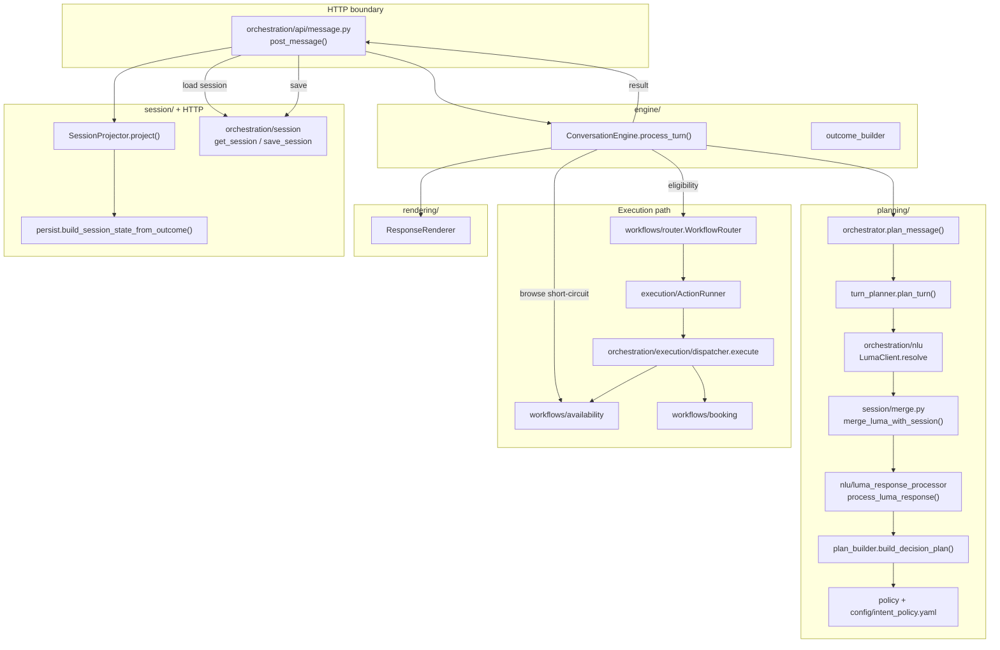
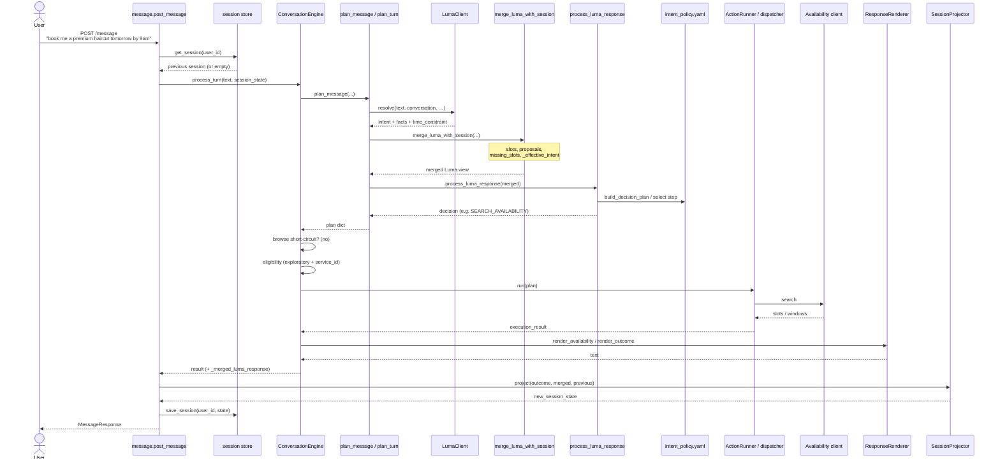
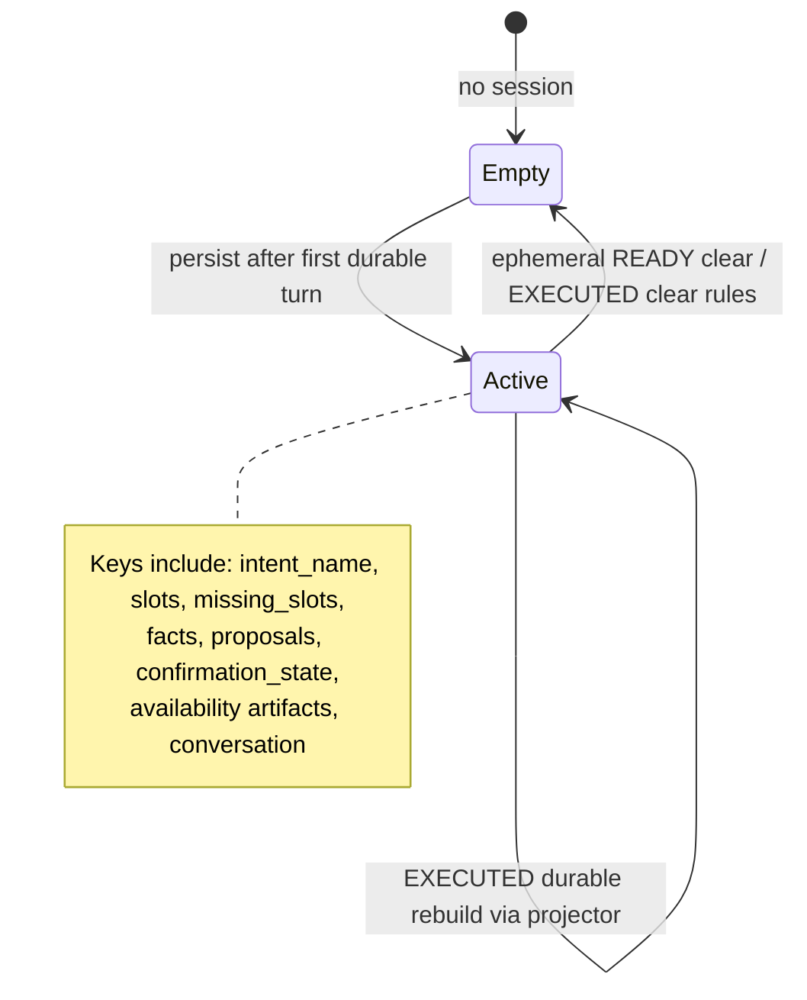

# Core Architecture Guide

**Audience:** engineers joining DialogCart who will change anything under `src/core/`.  
**Scope:** the **current** Core layer after package cleanup and `merge_luma_with_session` decomposition.  
**Companion docs:** root [`AGENTS.md`](../../AGENTS.md) (system ownership), [`AGENTS.md`](./AGENTS.md) (Core constitution), [`tracing/DECISION_TRACE.md`](./tracing/DECISION_TRACE.md).

Read this before changing orchestration, session, planning, or execution code.

---

## 1. What Core is

Core is the **orchestration layer** between:

| Outside Core | Role |
|---|---|
| **NLU (Luma)** | Stateless per-turn understanding: intent, facts, entities |
| **Capabilities / handlers (extensions)** | Optional payment, RAG, etc. — activated by Core, do not own session |
| **Commerce backends** | Availability and booking HTTP clients |

Core owns the **booking conversation lifecycle**: merge NLU deltas into session, decide what happens next (plan), optionally execute a policy-selected action, render a reply, and persist durable state.

---

## 2. High-level package structure

```
src/core/
├── engine/           # Production turn owner (ConversationEngine)
├── planning/         # NLU→merge→plan (TurnPlanner, plan builder, facts)
├── session/          # Session merge, persist, confirmation, invalidation
├── policy/           # Loaders for intent_policy.yaml
├── config/           # intent_policy.yaml, org/capability config
├── execution/        # ActionRunner façade → dispatcher
├── workflows/        # Availability / booking post-processing boundaries
├── rendering/        # User-facing text / availability presentation
├── routing/          # Intent/handler/clarification routers (extensions bridge)
├── tracing/          # Decision Trace + invariant stage checks
├── orchestration/    # Compatibility + shared infrastructure (see below)
├── docs/             # Contracts and deeper notes
└── tests/            # Core test suites
```

### Ownership of top-level packages

| Package | Owns | Does not own |
|---|---|---|
| **`engine/`** | Per-turn orchestration: plan → eligibility → execute → render. Entry: `ConversationEngine.process_turn()` | Session load/save, HTTP, capability runners |
| **`planning/`** | One planning turn: Luma call, session merge, decision plan, planning outcome. Entry: `plan_turn()` via `plan_message()` | Side-effecting booking commits |
| **`session/`** | Durable booking state: merge, confirm gate, invalidation, project-to-persist | HTTP store I/O (callers save), NLU |
| **`policy/` + `config/`** | Business sequencing and slot requirements (`intent_policy.yaml`) | Ad-hoc sequencing in Python |
| **`execution/`** | Dispatching `plan.action` to handlers (`ActionRunner` → `dispatcher.execute`) | Choosing *which* action (planner/policy) |
| **`workflows/`** | Domain post-processing after execution (browse short-circuit, availability cache, booking slot propagation) | Policy selection |
| **`rendering/`** | Turning plan/outcome/execution artifacts into user text | Deciding status/stage/action |
| **`routing/`** | Mapping intents/handlers for non-core / extension paths | Core booking policy |
| **`tracing/`** | Decision Trace + stage invariant checks | Business rules |
| **`orchestration/`** | Shared clients, NLU adapter, temporal proposals, time resolution, HTTP API, **compat wrappers** (`handle_message`, `plan_message`) | New production ownership (engine owns that) |

`orchestration/` is large for historical reasons. Treat **`engine.ConversationEngine`** as the production owner; use `orchestrator.plan_message` / `handle_message` as documented entrypoints or shims, not as places to grow new lifecycle logic.

---

## 3. Package / component diagram



---

## 4. Production request flow

### Example utterance

> **"book me a premium haircut tomorrow by 9am"**

Assume: first turn for this user, durable intent `CREATE_APPOINTMENT`, organization catalog can resolve “premium haircut” → `service_id`.

### End-to-end sequence (modules and functions)

| # | Stage | Module / function | What happens for this utterance |
|---|---|---|---|
| 1 | HTTP entry | `orchestration/api/message.py` → `post_message()` | Validates body; loads `_raw_session` via `get_session(user_id)` (empty on first turn). |
| 2 | Engine | `ConversationEngine.process_turn(text, user_id, session_state=…)` | Owns the turn. Does **not** load or save session. |
| 3 | Plan | `orchestrator.plan_message(...)` → `planning/orchestration/turn_planner.plan_turn(..., planning_only=True)` | Full planning pipeline (below). |
| 4 | NLU | `LumaClient.resolve(text, …)` | Returns intent `CREATE_APPOINTMENT`, facts (`service_id` / service text), `facts.dates`, `time_constraint` (e.g. by 9am). Does **not** write session. |
| 5 | Session merge | `session.merge.merge_luma_with_session(luma, session, planning_only=True)` | First turn: little session to merge. Promotes facts → slots; lifts temporal prefs into **proposals** (`date_proposal` / `time_proposal`); computes `missing_slots` from policy; sets `_effective_intent`. |
| 6 | Decision | `process_luma_response` → `build_decision_plan` | Interprets merged Luma + policy. Selects next step (typically exploratory `SEARCH_AVAILABILITY` when `service_id` satisfies `executable_with`). |
| 7 | Plan return | `plan_message` shapes planning dict | `intent_name`, `status`, `stage`, `action`, `slots`, `missing_slots`, proposals, `_merged_luma_response`, etc. |
| 8 | Browse gate | `AvailabilityWorkflow.try_handle_browse_turn` | No-op on first search turn (no browse operation). |
| 9 | Eligibility | `ConversationEngine` + `policy.intent_policy.get_execution_steps` | Exploratory `SEARCH_AVAILABILITY` needs `service_id` in slots → `can_execute=True` even if date/time are still proposals. |
| 10 | Execute | `WorkflowRouter` → `ActionRunner.run` → `dispatcher.execute` → `_execute_search_availability` | Calls availability client; may inject date from proposals via `slots_for_availability_search`. |
| 11 | Post-process | `AvailabilityWorkflow.process_search_result` / `BookingWorkflow.process_result` | Writes presentation / fingerprint artifacts into result and in-memory session view. |
| 12 | Render | `ResponseRenderer.render_availability` / `render_outcome` | User-visible text listing options / next ask. |
| 13 | HTTP post | `post_message` capability/handler boundaries | Skip for normal booking search. |
| 14 | Persist | `SessionProjector.project` → `build_session_state_from_outcome` → `save_session` | Persists durable intent, slots, proposals, facts, availability artifacts for the next turn. |

### Mermaid sequence diagram



---

## 5. Planning path in detail (`plan_turn`)

Production always calls planning with `planning_only=True` via `plan_message()`.

**File:** `planning/orchestration/turn_planner.py` — `plan_turn()`.

Typical stages (implementation-oriented):

1. **Tenant / catalog context** — org domain, catalog aliases for NLU.  
2. **Conversation memory** — `update_conversation` so Luma sees prior turns.  
3. **NLU** — `luma_client.resolve(...)`.  
4. **Intent continuity / reset detection** — durable session intent vs new Luma intent; may clear merge eligibility.  
5. **Merge eligibility** — `session.merge.should_merge_session_context(...)`.  
6. **Merge** — `merge_luma_with_session(...)` when eligible (see §6).  
7. **Process** — `process_luma_response(effective_response, …)` builds the decision.  
8. **Plan builder** — `build_decision_plan` reads `intent_policy.yaml` (via `core.policy.intent_policy` and planner helpers) to set `status`, `action`, `stage`, `awaiting`.  
9. **Outcome shaping** — planning result returned to the engine; **no booking side effects**.

`plan_message()` never executes `SEARCH_AVAILABILITY` or `CONFIRM_APPOINTMENT`. Execution starts only in `ConversationEngine` after eligibility.

---

## 6. Session merge (`merge_luma_with_session`)

**File:** `session/merge.py`.

After Phase 2 decomposition, `merge_luma_with_session` is a **coordinator** over named helpers:

| Helper | Responsibility |
|---|---|
| `_rehydrate_confirmation_state` | Restore confirmation gate from session |
| `_enforce_intent_authority` | STEP 1.5/1 — durable intent / `_effective_intent` |
| `_merge_facts` | Session facts ⊕ Luma facts |
| `_extract_raw_luma_slots` | Facts → raw slots, service_id reconcile |
| `_carry_forward_time_constraint` | Preserve session time_constraint |
| `_extract_semantic_slots` | Entities / semantic / booking → slots |
| `_merge_slots_additive` | Additive session⊕Luma slots, proposals, durability checks |
| `_handle_informational_turn_and_effective_intent` | Intent-change filter, MODIFY context, informational early return, effective intent |
| `_promote_and_bind` | Promote slots, CREATE_APPOINTMENT bind/invalidate, domain filter, strip unconfirmed temporal |
| `_compute_missing_slots` | Planner-based missing_slots + invariants |
| `_finalize_effective_slots_and_trace` | `_effective_collected_slots`, intent assert, merge trace |

Shared mutable carrier: `_MergeContext.merged` (same object as the coordinator’s `merged` dict).

**Rules of thumb (also in Core `AGENTS.md`):**

- Session is the source of truth for durable booking state.  
- Merge is additive unless an **invalidation** rule fires (`session/invalidation.py`).  
- Temporal preferences are **proposals** until bound/confirmed; they are not durable `slots.date` / `slots.time` by default.  
- `missing_slots` are derived once per turn from intent contract − effective slots.

---

## 7. What each major component owns

| Component | Owns | Key symbols |
|---|---|---|
| **HTTP API** | Request/response, session load/save, capability/handler boundary after the turn | `post_message`, `get_session`, `save_session`, `SessionProjector` |
| **ConversationEngine** | Turn orchestration after session is loaded | `process_turn` |
| **TurnPlanner** | NLU → merge → decision for one turn | `plan_turn`, `plan_message` |
| **Session merge** | Combining Luma delta with session | `merge_luma_with_session`, helpers above |
| **Policy** | Slot requirements + execution step graph | `config/intent_policy.yaml`, `policy/intent_policy.py` |
| **Plan builder** | Status / action / awaiting from policy + facts | `build_decision_plan` |
| **ActionRunner / dispatcher** | Performing the selected action | `ActionRunner.run`, `dispatcher.execute` |
| **Workflows** | Browse-without-search; availability presentation; booking post-process | `AvailabilityWorkflow`, `BookingWorkflow`, `WorkflowRouter` |
| **ResponseRenderer** | User text | `render_availability`, `render_outcome` |
| **Session persist** | Outcome → durable session dict | `build_session_state_from_outcome`, `intent_persist`, `missing_slots`, `appointment_extensions` |
| **Confirmation gate** | `pending` / consume-on-commit | `session/confirmation_gate.py` |
| **Decision Trace** | Why a turn did what it did | `tracing/decision_trace.py`, spine emitters |

---

## 8. Planning vs execution

| | **Planning** | **Execution** |
|---|---|---|
| **When** | Every turn, inside `plan_message` / `plan_turn` | Only if engine eligibility passes |
| **Inputs** | User text, session, Luma, policy | `plan.action`, slots, clients |
| **Outputs** | `status`, `stage`, `action` (nullable), `missing_slots`, facts | Backend side effects + execution_result |
| **Side effects** | None on commerce systems | Availability search, booking confirm, etc. |
| **Policy modes** | Completeness + which step is *selectable* | `exploratory` (partial slots OK) vs `committing` (needs `READY` + required slots + `requires` facts) |
| **Example** | Decide `SEARCH_AVAILABILITY` | Call availability API and cache presentation |

**Eligibility (engine):** for each policy step matching `plan.action`:

- **exploratory** — required slots for that step present (e.g. `service_id` for search).  
- **committing** — `plan_status == "READY"` and step required slots present (and policy `requires` facts such as `availability_ready`, `user_confirmation_satisfied` were already enforced when selecting the action).

If not eligible, engine returns a **planning response** (clarify / present state) without calling the dispatcher.

---

## 9. Session lifecycle



**Write path (HTTP):**

1. Engine returns `result` with `outcome` and often `_merged_luma_response`.  
2. `SessionProjector.project(...)` → `build_session_state_from_outcome(...)`.  
3. `append_messages_turn` for chat memory.  
4. `save_session(user_id, new_session_state)`.

**Read path (next turn):**

1. `get_session` → raw session into `ConversationEngine`.  
2. TurnPlanner / merge interpret eligibility and confirmation — HTTP must not “helpfully” filter the engine’s session.

**Statuses you will see:** `NEEDS_CLARIFICATION`, `AWAITING_CONFIRMATION`, `AWAITING_CAPABILITY`, `READY`, `EXECUTED`, plus pass-throughs like `HANDLER_DELEGATED` / `NON_CORE_INTENT`.

**Persistence stance:** prefer leaving `persist.py` as a linear assembler; hard rules already live in `intent_persist`, `missing_slots`, `appointment_extensions` (see `summary_persist_assessment.md`).

---

## 10. Key architectural principles

1. **ConversationEngine owns orchestration** — production turns go `message.py` → `process_turn`. Do not add new lifecycle branches to `handle_message` beyond session-load compatibility.  
2. **Policy owns sequencing** — `intent_policy.yaml` defines required slots, executable subsets, execution steps, `requires` facts, and durability. Planner code interprets; it must not invent booking order.  
3. **Session owns durable booking truth** — NLU is a per-turn delta. Merge decides retain / promote / discard.  
4. **Planning is pure; execution is gated** — `plan_message` does not call commerce clients for booking actions.  
5. **Proposals ≠ durable slots** — unconfirmed date/time stay in proposals until bind/confirm.  
6. **Confirmation authorizes commits only** — `confirmation_state` is not booking truth; successful commit consumes it; `booking_id` marks completion.  
7. **Invalidation is explicit** — slot drops go through `session/invalidation.py`, not ad-hoc deletes.  
8. **Presentation ≠ search** — browsing paginates cached availability; it must not trigger `SEARCH_AVAILABILITY`.  
9. **Decision Trace for debugging** — prefer trace nodes over new `logger.error` archaeology when changing orchestration.  
10. **Minimal change** — one architectural objective per change; do not “clean up” unrelated packages in the same PR (Core `AGENTS.md`).

---

## 11. Where to change what (cheat sheet)

| If you need to… | Start here |
|---|---|
| Change turn order / eligibility / when execute runs | `engine/conversation_engine.py` |
| Change NLU→plan pipeline | `planning/orchestration/turn_planner.py` |
| Change merge / slot durability / informational turns | `session/merge.py` (+ helpers) |
| Change required slots or step graph | `config/intent_policy.yaml` |
| Change how status/action are derived | `planning/orchestration/plan_builder.py` |
| Change commerce call behaviour | `orchestration/execution/dispatcher.py` |
| Change availability browse / cache presentation | `workflows/availability/`, `orchestration/availability_*` |
| Change what is written to Redis/session store | `session/persist.py` and siblings |
| Change user-facing wording | `rendering/` |
| Change HTTP / persistence timing | `orchestration/api/message.py` |

---

## 12. Appendix — Compatibility wrappers (why they still exist)

These are **current** shims. Prefer the canonical owner in new code; keep wrappers until call sites (especially tests) are migrated.

| Symbol | Location | Canonical owner | Why it remains |
|---|---|---|---|
| `handle_message()` | `orchestration/orchestrator.py` | `ConversationEngine.process_turn()` | Tests and legacy callers expect session three-fallback load + one function. Wrapper loads session, then delegates. |
| `plan_message()` | `orchestration/orchestrator.py` | `plan_turn(planning_only=True)` | Stable planning-only API for engine and tests. |
| `merge_session_with_luma_response` | `session/merge.py` | `merge_luma_with_session` | Historical alias. |
| `SessionProjector.project()` | `session/session_projector.py` | `build_session_state_from_outcome()` | Architectural façade for HTTP persistence; keeps persist internals swappable. |
| `ActionRunner.run()` | `execution/action_runner.py` | `dispatcher.execute()` | Execution boundary for the engine; thin today, intentional seam. |
| `ResponseRenderer` | `rendering/response_renderer.py` | LLM / availability inject helpers | Single rendering entry for the engine. |
| `WorkflowRouter` | `workflows/router.py` | client→workflow map | Routes by policy `client` field; keeps engine free of client-name switches growing unbounded. |
| Re-exports from `orchestrator.py` | outcome/render helpers | `engine/outcome_builder`, `rendering/` | Avoid breaking older imports after circular-dependency breakup. |

**Historical note (brief):** Core once concentrated turn lifecycle in `orchestrator.handle_message` / a monolithic merge function. Ownership moved to `ConversationEngine` and `session/merge` helpers; wrappers preserve the old import surface. Do not revive lifecycle logic inside the wrappers.

---

## 13. Suggested first-week reading order

1. This document.  
2. Root `AGENTS.md` + Core `AGENTS.md`.  
3. `config/intent_policy.yaml` (`CREATE_APPOINTMENT` section).  
4. `ConversationEngine.process_turn` (skim eligibility + execute).  
5. `merge_luma_with_session` coordinator (not every helper).  
6. `tracing/DECISION_TRACE.md` — run one turn with `DIALOGCART_TRACE_DECISIONS=1`.

Then make a small change behind a Decision Trace assertion rather than a large cross-package refactor.
